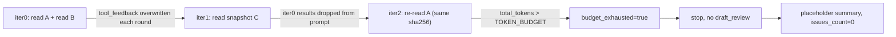
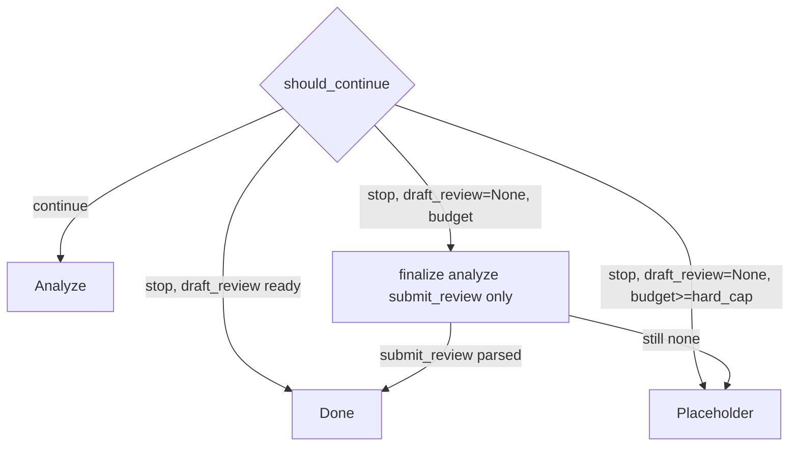

# Review 失败重分析：非迭代不足，而是"忘+截断+空兜底"

## 1. 新证据（对照两次 run）

- 失败（full trace, `REVIEW_MAX_ITERATIONS=4`）：[eval/outputs/event_logs/golden_astral-sh_ruff_pr24648_124aed86-e2e6-44b0-b38f-acb77b203bb2.jsonl](eval/outputs/event_logs/golden_astral-sh_ruff_pr24648_124aed86-e2e6-44b0-b38f-acb77b203bb2.jsonl)
- 成功（MVP, `qualified_report`）：[eval/outputs/qualified_report.json](eval/outputs/qualified_report.json)

| 维度              | MVP 成功                                  | 当前失败                                            |
| --------------- | --------------------------------------- | ----------------------------------------------- |
| iterations 实际走到 | 2（iter 1 "No tools requested" → submit） | 3（全是 tool_calls，无 submit）                       |
| total_tokens    | 13036（也 budget_exhausted）               | 15380（iter 2 已 budget_exhausted）                |
| draft_review    | 有，3 条 issue（matched=1, fp=2）            | 一直没有                                            |
| tool 行为         | iter 0 读文件/综合 → iter 1 submit           | iter 0 读 A+B，iter 1 读 snapshot，**iter 2 又读了 A** |

关键细节——**重复读同一文件**：iter 0 第一次 `read_file` 的 `args_digest.sha256` 是 `992d06dd...`（读 `async_function_with_timeout.rs`），iter 2 的 `read_file` `sha256` **完全相同**。说明模型在 iter 2 看不到 iter 0 读过的内容，重新要了一次。

## 2. 根因链（改写）

核心三条，按贡献排序：

- **C1 tool_feedback 只保留当轮（数据流层）**。`[src/orchestrator/agent_loop.py](src/orchestrator/agent_loop.py:399)` 的 `self._tool_feedback = executed_feedback` 整体覆盖；而 `[src/analyzer/prompts.py](src/analyzer/prompts.py:42)` 每轮通过 `build_review_messages` 重建 messages，历史只能靠 `tool_feedback` 再注入。结果：iter 2 的 prompt 只带 iter 1 的 snapshot 读取，**iter 0 读过的两个核心文件都不在上下文里**，模型只能重读。这在 MVP 版 2 轮场景下不会暴露（第二轮就 submit 了），现在 3+ 轮场景下直接崩。
- **C2 TOKEN_BUDGET 偏紧（预算层）**。`[src/config.py](src/config.py:57)` 默认 `TOKEN_BUDGET=12000`，是**累计完成+输入 tokens**（`_latest_tokens = response.usage.total_tokens`，`format_result` 里 `self._total_tokens += self._latest_tokens`）。iter 2 末尾累计 15380 就 `budget_exhausted=True`，`should_continue` 直接 stop。MVP 成功 run 也触发了 budget_exhausted（13036），但那时 **draft 已在 iter 1 就绪**，截断不影响输出；现在"还没 submit 就被砍"。
- **C3 空兜底（编排层）**。`should_continue` 停止后若 `plan.draft_review is None`，`[src/analyzer/result_processor.py](src/analyzer/result_processor.py:26)` 返回 placeholder，但 `schema_valid=True` 照样通过评测断言，无兜底提交也无告警。这不是失败"原因"，但把失败**伪装成了合规输出**。

此外两个辅助因素（非主因，仍值得修复）：

- **C4 重复工具调用无识别**：`execute_tools` 没有"args 已见过"缓存，重读整文件再白烧一轮 tokens。
- **C5 prompt 不会在末轮"收口"**：`SYSTEM_PROMPT_REVIEW` / `USER_PREFIX_REVIEW` 每轮一致，模型没有"这是最后一轮必须 submit"的显式信号。

## 3. 上下文混合策略变化的影响

你提到"核心模块仅优化了上下文的混合策略"。结合代码：`[src/analyzer/inference_engine.py](src/analyzer/inference_engine.py:66)` 中 `context_summary_enabled` 默认 `true`，每轮调用 `build_review_messages_async` 重新做优先级截断 + 二次 LLM 摘要拼接。这里有两个副作用：

- 摘要本身要 token，**放大了 C2**：iter 2 虽然 prompt_tokens 反而下降（4142 vs 5545），说明摘要/截断让历史信息被压缩甚至丢掉，等于加剧了 C1。
- 摘要是"对当前 payload 的压缩"，**不会把之前几轮 tool 结果塞进来**——这部分仍完全依赖 `tool_feedback`。所以"上下文混合策略"并没有替代累积 feedback 的职责。

结论：改动本身没有 bug，但它把 MVP 时期"信息充裕所以 2 轮就够"的隐含前提**暴露了**——在当前更节省 prompt 的拼接策略 + 轮数放大之后，C1 的缺陷被激活。

## 4. 改进策略（按投入产出）

### P0 — 直接解决本次失败（确认方案）

1. **tool_feedback: 最近 N 轮 + digest 索引**（C1）。
  - 数据结构：`self._tool_feedback: deque[FeedbackEntry]`，条目 `{iteration, tool_call, result, args_digest, result_digest}`。
  - 窗口：新增 `FEEDBACK_WINDOW_ITERATIONS`（默认 3），在 `[src/orchestrator/agent_loop.py](src/orchestrator/agent_loop.py:399)` `execute_tools` 结束时 `extend` 并按窗口淘汰最旧条目。
  - Digest 索引：`self._feedback_digest_index: dict[sha256, FeedbackEntry]` 跨窗口保留全部历史摘要，被淘汰出窗口的条目仍通过 index 保存 `(iteration, name, args_preview, result_preview_truncated_or_summary)`，不保留完整 body。
  - 注入方式（`[src/analyzer/inference_engine.py](src/analyzer/inference_engine.py:284)` `_build_tool_feedback_messages`）：
    - 窗口内条目原样注入（`assistant tool_calls` + `tool` result），并在 content 里加 `[iter=N]` 前缀。
    - 窗口外条目折叠成一条 `role="user"` 的"prior_tool_results_summary"消息，列出 `iter, name, args_preview, short_result_preview`，让模型知道「这些已经读过，不要重复」。
    - 按预算从旧到新裁剪，始终保留最新一轮原样。
2. **Force-submit 兜底**（C3 + C2 软降级汇聚点）。
  - 触发条件：`should_continue` 返回 stop 且 `draft_review is None`，**不论 reason**（max_iterations / budget_soft_capped / model_completed-but-no-draft）。
  - 实现：`run_review` 外层在 break 后追加一次 `analyze(..., force_submit=True)`；`InferenceEngine.analyze` 新参数 `force_submit` 传到 prompt 构造器，走 `[src/analyzer/prompts.py](src/analyzer/prompts.py)` 新增 `build_review_finalize_messages`（system 里加入 "this is the final call, output must be submit_review with the best conclusion from accumulated tool_feedback"；不再 build tool_schemas，只给 `build_submit_tool_schemas()`）
  - 若 finalize 返回仍无 `draft_review`，再尝试 `_fallback_extract_json`；仍无则保留原 placeholder 并在 trace 打 `finalize_failed=true`。
3. **Token budget: 加大 + 软降级**（C2）。
  - `[src/config.py](src/config.py:57)` 默认 `TOKEN_BUDGET`：12000 → 24000。`.env.example` 同步注释升级理由。
  - `[src/analyzer/result_processor.py](src/analyzer/result_processor.py:96)` `is_budget_exhausted` 拆成 `soft_cap` 与 `hard_cap`：
    - `soft_cap = token_budget`（1x）：不直接 stop，而是让 `should_continue` 进入 "only finalize" 状态——跳过 analyze→tools，直接走 P0.2 force-submit。
    - `hard_cap = 2 * token_budget`：硬停，走原有 placeholder 路径（此时连 finalize 也不再尝试，避免成本爆炸）。
  - `should_continue` 的 payload 新增 `budget_state: none|soft_capped|hard_capped`，和 P1 的 `reason` 合并输出。

### P0 数据流示意

### P1 — 数据流水线健壮性

1. **重复 tool 调用识别**（C4）。在 `execute_tools` 里按 `args_digest.sha256` 维度去重：相同 digest 在同一 run 内直接命中缓存，回一个"already_read_this_iteration_N, see prior feedback"的 `ToolResult`，并在 trace 中打 `dedup_hit=true`。避免浪费轮次与 token。
2. **失败画像**（C3 的评测侧延伸）。`EvalResult` 增加 `placeholder_summary: bool`、`finish_reasons: list[str]`、`submit_review_seen_any: bool`、`budget_exhausted: bool`；`[eval/metrics.py](eval/metrics.py)` 将 placeholder 从 `schema_validity_rate` 的分子剔除或单列；让"假成功"一眼可见。
3. **decision 事件增强**。`should_continue` payload 加 `reason` 枚举与累计 `submit_review_seen_any`，便于日志级聚合。

### P2 — Prompt 收口

1. 在 `iteration >= max_iterations - 1` 时切换为 finalize prompt（与 P0.2 互为前后关系：P0 是硬兜底，P2 是软引导），并在检测到 `args_digest` 重复时在下一轮 prompt 追加提醒"you already read X, synthesize now"。

## 5. 已定方案摘要

- Token budget：**加大默认到 24000 + 软/硬双阈值**（soft=1x 触发 finalize-only，hard=2x 硬停）。
- tool_feedback：**窗口 N=3 轮 + digest 索引**（窗口外折叠成摘要 user message 注入）。

新增配置（`.env.example` 同步）：

- `TOKEN_BUDGET=24000`
- `FEEDBACK_WINDOW_ITERATIONS=3`

实施顺序建议（便于自测对照）：

1. 先做 P0.1（窗口 + digest 索引），用当前失败 fixture 重跑，预期 iter 2 不再重复读 A。
2. 再叠 P0.3（budget 软降级），验证到达 soft_cap 不直接 placeholder。
3. 最后叠 P0.2（force-submit），闭环失败兜底。
4. P1/P2 作为稳定化追加。

## 6. 不涉及

- 不改 fixture、不改 human-expected。
- 不动 `tempfile.TemporaryDirectory` 策略（event log 已落到 `eval/outputs/event_logs/`）。
- 不改 debug 模式（改造落地后可镜像）。

