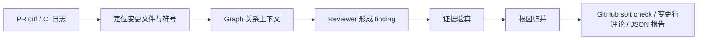

# MergeWarden

> 面向工程团队的 AI Pull Request 守门员：把代码变更、跨文件关系和 CI 证据，整理成开发者真正能执行的审查结论。

MergeWarden 会阅读 PR diff、相关代码、测试结果与 CI 日志，识别安全性、正确性、可靠性和可维护性风险，并输出带有代码位置、证据、根因、影响和最小修复方向的结构化报告。

[查看产品展示页](https://merge-warden.vercel.app/) · [GitHub Action 接入指南](docs/github_action_self_hosted.md)

## 为什么使用 MergeWarden

普通的 AI Review 往往只围绕 diff 做表面总结；真正危险的问题，通常藏在调用方、状态流转、缓存键、测试契约或跨模块不变量里。MergeWarden 将审查范围从“改了哪几行”扩展到“这些改动会改变什么行为”，同时要求每一条风险都能回到具体代码证据。

它适合：

- 在合并前补充一层可追溯的 AI 风险审查。
- 快速定位 CI 失败、回归根因和缺失的测试覆盖。
- 处理跨文件、跨模块和两跳依赖的复杂 PR。
- 将审查结果发布为 GitHub 建议式检查、变更行评论和 JSON 产物。

## 核心能力

### 变更中心的 PR 审查

围绕 PR 的真实行为变化审查安全性、正确性、可靠性、性能和工程规范。每个 finding 都包含严重级别、置信度、代码位置、观察到的行为、因果机制、违反的不变量、影响和修复意图。

### Graph 图谱引导

Graph 会从变更的文件和符号出发，连接调用方、被调用方、导入关系、状态读写和测试关联，生成与当前变更最相关的上下文。它尤其适合定位“改动在 A 文件，问题在 B 文件”的跨文件和多跳问题。

默认启用 Graph（内部模式名为 <code>graph_hybrid</code>）。如需使用纯工具搜索模式，可在 <code>.env</code> 中设置：

~~~dotenv
REVIEW_CONTEXT_MODE=agent_search
~~~

对大型 PR，建议同时设置合理的图上下文和总 token 预算，让上下文始终服务于最终证据，而不是挤占提交空间：

~~~dotenv
RELATION_GRAPH_MAX_CONTEXT_TOKENS=4000
TOKEN_HARD_BUDGET=36000
~~~

### 证据约束与根因归并

MergeWarden 会对候选 finding 进行语义验真和确定性证据检查：没有足够证据的结论会被拒绝或降级，不会因为“听起来合理”就直接发布。多个症状指向同一机制时，系统会在证据支持的前提下归并为一个根因，减少重复噪声。

### CI 失败诊断

读取测试失败输出和 CI 日志，提取关键错误，关联到代码上下文，并给出下一步验证方式与最小修复方向。

### GitHub 建议式交付

可发布 neutral check、变更行评论、审查摘要和可下载 artifact。评论只落在 changed lines；无法安全映射到变更行的发现会保留在 check summary 中。

## Graph 带来的提升

来自真实 PR 样本的表现：

| 指标 | Graph 相对 Agent Search |
| --- | ---: |
| 总 token | **减少 27.3%** |
| Reviewer 时延 | **降低 53.5%** |
| 带工具的审查迭代 | **减少 58.8%** |
| 符号查询 | **减少 87.5%** |
| Clean PR 误报 | **0** |

### 代表性样本

| 样本 | 场景 | 观察结果 |
| --- | --- | --- |
| [<code>pytest-dev/pytest#9350</code>](https://github.com/pytest-dev/pytest/pull/9350) | <code>SafeHashWrapper</code> 的包装对象相等性与 fixture cache key | Graph 识别 <code>SafeHashWrapper.__eq__</code> 未正确解包 <code>other</code> 的根因，并关联 fixture cache key 的影响链路；finding 最终保留。 |
| [<code>pydantic/pydantic#12117</code>](https://github.com/pydantic/pydantic/pull/12117) | private attribute 状态与复制行为 | Graph 识别状态与复制行为相关的回归，没有引入额外误报。 |
| [<code>pydantic/pydantic-ai#6205</code>](https://github.com/pydantic/pydantic-ai/pull/6205) | 跨 adapter 不变量 | Graph 沿 adapter 关系梳理跨模块不变量，适合发现接口契约被破坏的风险。 |
| [<code>fastapi/fastapi#15077</code>](https://github.com/fastapi/fastapi/pull/15077) | 多跳依赖与状态恢复 | Graph 沿多跳依赖追踪状态恢复链路，适合定位跨模块的隐性回归。 |
| 多个 clean PR 样本 | Clean PR | Graph 与 Agent Search 都保持 **0 false positive**。 |

Graph 的主要产品价值是：用更少的探索成本获得更密集的结构化上下文，同时保持对 clean PR 的克制。对于超大 PR，可通过变更范围、图上下文上限和总预算控制上下文规模。

## 工作方式

## 输入与输出

输入可以是：

- 本地仓库路径。
- Git diff 或 PR patch。
- 指定文件、测试失败输出或 CI 日志。
- GitHub Actions 中生成的 PR diff 与 changed-lines 映射。

输出包括：

- 结构化 Review 报告。
- 严重级别、置信度和准确代码位置。
- 观察行为、因果机制、违反的不变量和影响分析。
- 最小修复方向与建议测试。
- CI 失败诊断和验证步骤。
- GitHub soft check、变更行评论、事件日志和运行摘要。

## 快速开始

### 本地运行

环境要求：Python 3.11 或更高版本，以及一个 OpenAI-compatible 模型服务。

~~~bash
git clone https://github.com/takagibit18/MergeWarden.git
cd MergeWarden

python -m venv .venv
source .venv/bin/activate
pip install -r requirements.txt

cp .env.example .env
~~~

在 <code>.env</code> 中填写 <code>OPENAI_API_KEY</code>，然后运行一次 PR 审查：

~~~bash
python cli.py review . --diff \
  --output-json review_response.json \
  --summary-json run_summary.json
~~~

诊断测试或 CI 错误：

~~~bash
python cli.py debug . --error-log ci.log
~~~

Windows PowerShell 启用虚拟环境：

~~~powershell
.\.venv\Scripts\Activate.ps1
~~~

### Docker

~~~bash
docker compose up -d --build
curl http://localhost:8000/health
docker compose down
~~~

Compose 会启动共享持久化卷的 FastAPI 服务与 Platform Worker。

### FastAPI 服务

~~~bash
uvicorn src.api.app:app --reload
~~~

主要接口：

- <code>GET /health</code>
- <code>POST /review</code>
- <code>POST /debug</code>
- <code>GET /runs/{run_id}/summary</code>
- <code>POST /github/webhook</code>

### GitHub Actions

#### 10 分钟接入 GitHub Action 自托管审查

在目标仓库中复制[自托管 workflow 模板](docs/examples/github-advisory-self-hosted.yml)，并配置：

1. Repository secret：<code>OPENAI_API_KEY</code>。
2. Repository variable：<code>MERGEWARDEN_REPOSITORY</code>，例如 <code>takagibit18/MergeWarden</code>。
3. Repository variable：<code>MERGEWARDEN_REF</code>，建议固定到 release tag 或稳定分支。
4. 私有 runtime 仓库可额外配置 <code>MERGEWARDEN_REPOSITORY_TOKEN</code>。
5. 非 OpenAI provider 可配置 <code>OPENAI_BASE_URL</code>、<code>MODEL_NAME</code> 和
   <code>MODEL_PROVIDER</code>；例如智谱 GLM 使用 provider id <code>zhipu</code>。

成功运行后，PR 中会出现 neutral check 和变更行建议评论，同时上传审查 JSON、运行摘要、diff、发布结果和事件日志。Fork PR 默认只保留 dry-run artifact，不直接写评论。

完整配置、权限和排障说明见 [GitHub Action 接入指南](docs/github_action_self_hosted.md)。

## 产品边界

MergeWarden 是 advisory PR reviewer，不是自动合并门禁：

- 不自动批准或拒绝 PR。
- 不替代 CI、测试、代码所有者审批或 branch protection。
- 默认不修改用户代码、不创建修复提交。
- 低置信度或缺少可核验代码证据的 finding 不会被强行发布。

## 开发

安装开发依赖：

~~~bash
pip install -r requirements-dev.txt
~~~

运行测试与质量检查：

~~~bash
pytest
ruff check .
ruff format --check .
mypy src/
~~~

贡献代码前请阅读[贡献指南](CONTRIBUTING.md)。

## 许可证

[MIT](LICENSE)
