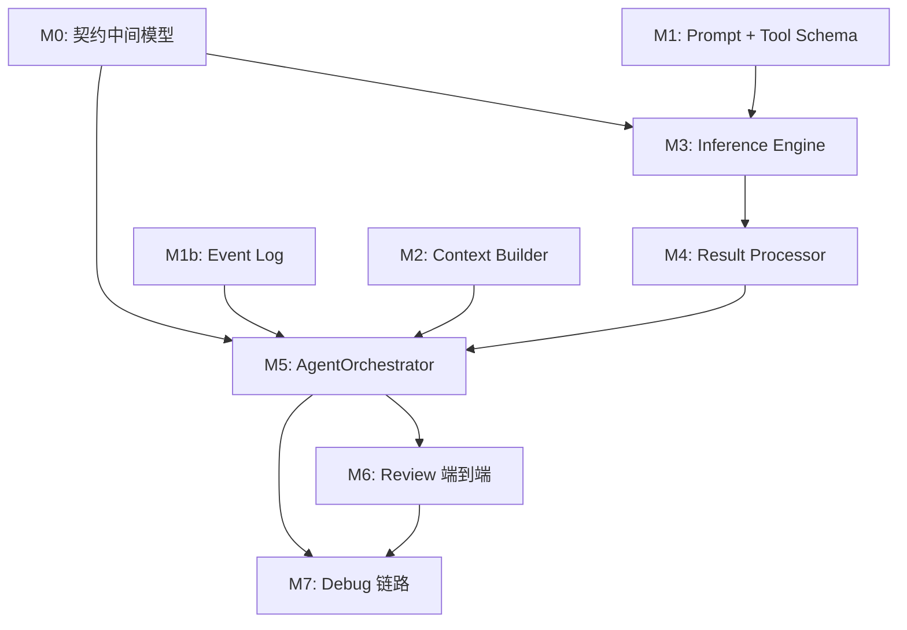

# Analyzer 核心模块开发顺序与选型记录

> 基准契约：[shared_contracts.md](./shared_contracts.md)、[cli_tools_orchestrator_contract.md](./cli_tools_orchestrator_contract.md)

---

## 1. 现状总览

### 1.1 已完成（可直接依赖）

- **Model 层** — `ModelClient` 异步调用、重试、Token 追踪（[src/models/client.py](../src/models/client.py)）
- **Model 数据模型** — `ModelConfig`, `Message`, `ModelResponse`, `TokenUsage`（[src/models/schemas.py](../src/models/schemas.py)）
- **异常体系** — `ModelClientError` 及子类（[src/models/exceptions.py](../src/models/exceptions.py)）
- **会话状态** — `ContextState`, `DecisionStep`, `ErrorDetail`（[src/analyzer/context_state.py](../src/analyzer/context_state.py)）
- **Review 输出** — `Severity`, `ReviewIssue`, `ReviewReport`（[src/analyzer/output_formatter.py](../src/analyzer/output_formatter.py)）
- **请求/响应契约** — `ReviewRequest`, `ReviewResponse`, `DebugRequest`, `DebugResponse`, `DebugStep`, `SuggestedCommand`（[src/analyzer/schemas.py](../src/analyzer/schemas.py)）
- **工具基础** — `BaseTool`, `ToolSpec`, `ToolSafety`, `ToolRegistry`（[src/tools/base.py](../src/tools/base.py)）
- **配置** — `Settings`, `get_settings()`（[src/config.py](../src/config.py)）
- **契约中间模型** — `AnalysisPlan`（[src/analyzer/schemas.py](../src/analyzer/schemas.py)）、`ToolResult`（[src/tools/base.py](../src/tools/base.py)）
- **Prompt 与消息** — `SYSTEM_PROMPT_*`、`build_review_messages` / `build_debug_messages`（[src/analyzer/prompts.py](../src/analyzer/prompts.py)）
- **编排层工具 schema** — `build_tool_schemas`、`build_submit_tool_schemas`（[src/orchestrator/tool_schemas.py](../src/orchestrator/tool_schemas.py)，契约 §9.2）
- **事件日志** — `EventType`、`EventEntry`、`EventLog`（[src/analyzer/event_log.py](../src/analyzer/event_log.py)）
- **上下文构建** — `ContextBuilder`、`context_priority`（[src/analyzer/context_builder.py](../src/analyzer/context_builder.py)、[src/analyzer/context_priority.py](../src/analyzer/context_priority.py)）
- **推理引擎** — `InferenceEngine`（[src/analyzer/inference_engine.py](../src/analyzer/inference_engine.py)）
- **结果处理** — `ResultProcessor`（[src/analyzer/result_processor.py](../src/analyzer/result_processor.py)）
- **编排主循环** — `AgentOrchestrator`（[src/orchestrator/agent_loop.py](../src/orchestrator/agent_loop.py)）

### 1.2 仍与计划有差距的演进项（可选迭代）

以下不影响当前契约闭环，可作为后续增强：

| 项 | 说明 |
|------|------|
| `ContextBuilder` 与截断 | `truncate_context` 已通过 `prompts.build_*_messages` 与 [context_priority.py](../src/analyzer/context_priority.py) 接入推理消息拼装；`load_diff` 当前为 `git diff --cached`（暂存区），与「工作区全量 diff」语义可能不同。 |
| 事件日志粒度 | 计划中的「每 phase 成对 phase_start/end」与部分观测点仍可按需补全。 |
| 异常兜底 | 计划中的「连续 2 次工具失败降级」等策略可按需细化。 |

### 1.3 模块落地状态（与 §1.1 对应）

| 模块 | 状态 | 位置 |
|------|------|------|
| 契约中间模型（`AnalysisPlan`, `ToolResult`） | 已实现 | `src/analyzer/schemas.py` / `src/tools/base.py` |
| Prompt 模板 + 消息构建 | 已实现 | `src/analyzer/prompts.py` |
| OpenAI function schema（工具 + submit 伪工具） | 已实现 | `src/orchestrator/tool_schemas.py`（由编排层组装后传入推理引擎） |
| 事件日志（会话级 JSONL） | 已实现 | `src/analyzer/event_log.py` |
| 上下文构建器 + 优先级分块 | 已实现（见 §2.3） | `src/analyzer/context_builder.py`、`src/analyzer/context_priority.py` |
| 推理引擎 | 已实现（含 `tool_feedback` 回灌） | `src/analyzer/inference_engine.py` |
| 结果处理器 | 已实现 | `src/analyzer/result_processor.py` |
| Agent 编排主循环 | 已实现（含高危门控、可配置轮次与 token） | `src/orchestrator/agent_loop.py` |


---

## 2. 技术选型记录

### 2.1 Prompt 模板与会话历史管理

**选定方案：Python 模块（模板） + 内存短缓存 + 会话级 JSONL 事件日志（历史）**

两层设计：

**（A）Prompt 模板** — `src/analyzer/prompts.py`

- 系统提示词、任务模板定义为模块级常量
- 通过 `build_review_messages()` / `build_debug_messages()` 组装完整消息序列
- **OpenAI function calling 的 `tools` 列表**（含注册工具 + `submit_review` / `submit_debug` 伪工具）由编排层 [`src/orchestrator/tool_schemas.py`](../src/orchestrator/tool_schemas.py) 负责转换与维护（契约 `cli_tools_orchestrator_contract.md` §9.2），`AgentOrchestrator.analyze` 组装后传入 `InferenceEngine.analyze(..., tool_schemas=...)`
- 理由：MVP 模板数量少（不超过 5 个），纯 Python 类型安全、IDE 友好，无需 Jinja2

**（B）会话历史 / 事件日志** — `src/analyzer/event_log.py`

- 内存短缓存：维护最近 N 条请求/响应对，供 `InferenceEngine` 在多轮循环中快速组装上下文
- 会话级 JSONL 持久化：每个 session（run_id）一个 `.jsonl` 文件，追加写入事件记录（model call、tool call、decision、error）
- 数据模型：`EventType` 枚举：`EventEntry(timestamp, run_id, event_type, phase, payload)` — Pydantic 模型，逐行 JSON 序列化
- 存储路径：环境变量 `EVENT_LOG_DIR`（默认 `.mergewarden/logs`）。若为**相对路径**，则解析为 `{repo_path}/{EVENT_LOG_DIR}/{run_id}.jsonl`（`repo_path` 来自请求）；若为绝对路径则直接使用该目录下的 `{run_id}.jsonl`
- 理由：
  - 内存缓存避免多轮循环中反复读盘
  - JSONL 追加写入性能好、可增量读取，天然适合事件流
  - 同时满足可观测性（§7 run_id + 工具调用序列 + token 用量）和复盘需求

### 2.2 LLM 结构化输出解析策略

**选定方案：Tool Calling（定义 `submit_review` / `submit_debug` 伪工具）**

- 模型通过 function call 返回符合 `ReviewReport` / `DebugResponse` schema 的 JSON
- 与契约 `AnalysisPlan` 的关系：`InferenceEngine` 解析模型返回的 tool_calls，区分：
  - 普通工具调用 -> 填入 `AnalysisPlan.tool_calls`
  - `submit_review` / `submit_debug` -> 解析为 `AnalysisPlan.draft_review` / `draft_debug`
- 降级策略：若 tool_calls 为空或解析失败，回退到从 `content` 字段提取 JSON 块（正则兜底）
- 理由：
  - 与现有 `ToolSpec` / `ToolRegistry` 体系统一
  - `ModelClient.chat()` 已支持 `tools` 参数，无需改动 Model 层
  - 兼容所有支持 function calling 的 OpenAI 兼容 API（不依赖 `response_format`）
- 不选 response_format：强绑定 OpenAI 专有接口，与可换 provider 设计矛盾
- 不选自由文本解析：鲁棒性最差

### 2.3 上下文窗口管理

**选定方案：已升级为混合策略（优先级截断 + 溢出块 LLM 摘要）**

**实现位置（与代码对齐）**

- **层级常量与分块工厂**：[src/analyzer/context_priority.py](../src/analyzer/context_priority.py) — `TIER_META`（10_000）、`TIER_ERROR_LOG`（20_000）、`TIER_DIFF`（30_000）、`TIER_FILES`（40_000）、`TIER_STRUCTURE`（50_000）；子索引递增（如第 *i* 个 hunk 为 `TIER_DIFF + i`），保证全序不与其它层碰撞。`ContextBuilder.truncate_context` 按 `priority` **升序**贪心装入。
- **Review**：meta（短 JSON：`repo_path`、`diff_mode`、`diff_text`、`constraints`）→ diff（`split_diff_hunks`：含 `diff --git` 时先按文件分段，再按 `@@` 拆 hunk）→ 相关文件（路径 **字典序**）→ 可选 `project_structure`。
- **Debug**：meta → `error_log_loaded` → 文件（字典序）→ 可选 `project_structure`（错误日志层仅在 Debug 出现，与 Review 分支一致于总排序文档）。
- **消息组装**：[src/analyzer/prompts.py](../src/analyzer/prompts.py) 对可截断块执行 `truncate_context` 后，经 `assemble_review_payload` / `assemble_debug_payload` 拼回单条 user JSON，并写入 `truncated`（`any` / `diff_hunks` / `files` / `error_log` / `structure`）。
- **输入侧预算**：环境变量 **`PROMPT_INPUT_TOKEN_BUDGET`**（默认 `32000`，`Settings.prompt_input_token_budget`）约束 **可截断块** 的 token 估算总和；与 Phase 4 运行累计终止的 **`TOKEN_BUDGET`**（`Settings.token_budget`）语义分离。
- **多轮 tool 反馈**：`InferenceEngine` 仍完整追加 `assistant`/`tool` 消息；首轮 user 正文经上述截断。

MVP 阶段（设计目标，与实现对齐）：

- 上下文加载优先级（高到低）：系统提示词（系统消息，不计入可截断块列表）> 错误日志（仅 Debug）> diff/变更文件 > 相关文件片段 > 项目结构概览
- 截断粒度：以文件 / diff hunk 为单位，不打断单个 hunk
- token 估算：`tiktoken`（`cl100k_base`）；不可用时回退 `len(text)//4`

已落地要点：

- 第一层：保持 `ContextBuilder.truncate_context` 的优先级贪心截断（零额外 API 成本）
- 第二层：当预算溢出导致块被丢弃时，调用 `ContextCompressor` 对溢出块做摘要，再次装入预算
- 摘要层默认开启（`CONTEXT_SUMMARY_ENABLED=true`），每块输出上限由 `SUMMARY_MAX_TOKENS_PER_PART` 控制

### 2.4 Agent 循环终止策略

**选定方案：ABC 混合策略（模型信号 + stop hooks + 轮次上限 + token 预算）**

三条终止路径协同工作：

**（A）模型自然完成（Phase 2 判定）**

- 若模型在 Phase 2（`analyze`）返回的 `tool_calls` 为空（无 tool_use），且 Phase 4（`format_result`）的 stop hooks 未报出阻塞错误，则循环以 `Terminal: completed` 结束
- 这是最常见的正常退出路径

**（B）轮次上限（Phase 5 判定）**

- `should_continue()` 检查当前轮次是否达到最大值
- 默认上限：Review 模式 1 轮，Debug 模式 3 轮（可通过环境变量 `REVIEW_MAX_ITERATIONS`、`DEBUG_MAX_ITERATIONS` 覆盖，见 `Settings`）
- 达到上限 -> 强制终止，输出已有结果
- 上限值通过 `Settings`（环境变量）读取

**（C）Token 预算（Phase 4 判定）**

- `format_result()` 阶段检查累计 token 用量是否超出预算
- 超预算 -> 标记为 `budget_exhausted`，进入终止流程
- 预算值由 `Settings.token_budget`（环境变量 `TOKEN_BUDGET`，默认 12000）控制

**异常兜底**：

- 连续 2 次工具调用失败或模型返回空结果 -> 降级终止，输出部分结论
- 模型异常（如 `ModelClientError`）-> 记入 `ContextState.errors`，降级输出

### 2.5 Debug 输出模型

**状态：已定稿，无需本期设计**

Debug 输出模型已在 [src/analyzer/schemas.py](../src/analyzer/schemas.py) 中实现，与 [shared_contracts.md §5](./shared_contracts.md) 完全对齐：

- `DebugStep`（title / detail / location / evidence / confidence）
- `SuggestedCommand`（command / rationale / risk）
- `DebugResponse`（run_id / summary / hypotheses / steps / suggested_commands / suggested_patch / context）

`DebugStep.location` / `evidence` / `confidence` 与 `ReviewIssue` 语义对齐（shared_contracts §5.1）。

---

## 3. 模块开发顺序

开发顺序遵循**依赖优先、自底向上**原则。




### M0: 契约中间模型补全（0.5 天）

**状态：已实现。** 以下为落地位置与形状备忘。

- `**AnalysisPlan**` — 放入 `src/analyzer/schemas.py`

```python
class AnalysisPlan(BaseModel):
    needs_tools: bool
    tool_calls: list[dict[str, Any]]
    draft_review: ReviewReport | None = None
    draft_debug: DebugResponse | None = None
```

- `**ToolResult**` — 放入 `src/tools/base.py`（与 `BaseTool` 同文件）

```python
class ToolResult(BaseModel):
    ok: bool
    data: Any = None
    error: str | None = None
```

- **依赖**：无新依赖，纯 Pydantic 定义
- **交付标准**：模型实例化、序列化测试通过；与契约文档字段一一对应

### M1: Prompt 模板 + Tool Schema 转换（1 天）

- **Analyzer（消息）**：`src/analyzer/prompts.py`
  - `SYSTEM_PROMPT_REVIEW` / `SYSTEM_PROMPT_DEBUG`
  - `build_review_messages(...)` / `build_debug_messages(...)` → `list[Message]`
- **Orchestrator（工具 schema，契约 §9.2）**：`src/orchestrator/tool_schemas.py`
  - `build_tool_schemas(specs: list[ToolSpec]) -> list[dict]`
  - `build_submit_tool_schemas() -> list[dict]`（`submit_review` / `submit_debug`）
- **依赖**：`Message`（models/schemas）、`ContextState`（context_state）、`ToolSpec`（tools/base）、请求模型（analyzer/schemas）
- **交付标准**：消息组装逻辑单测、编排层 tool schema 格式合法性校验（见 `tests/test_orchestrator_tool_schemas.py`）

### M1b: 事件日志系统（1 天）

- **文件**：`src/analyzer/event_log.py`（新建）
- **内容**：
  - `EventType` 枚举：`model_call` / `tool_call` / `decision` / `error` / `phase_start` / `phase_end`
  - `EventEntry(BaseModel)`：`timestamp`, `run_id`, `event_type`, `phase`, `payload`（dict）
  - `EventLog` 类：
    - `__init__(run_id: str, log_dir: Path)`：初始化缓存和 JSONL 文件句柄
    - `record(event: EventEntry) -> None`：同时写入内存缓存 + 追加到 JSONL
    - `recent(n: int) -> list[EventEntry]`：从内存缓存取最近 N 条
    - `replay() -> list[EventEntry]`：从 JSONL 文件重放全部事件（用于复盘）
    - `close() -> None`：刷新并关闭文件句柄
  - 内存缓存使用 `collections.deque(maxlen=N)`，N 默认 50
- **依赖**：无外部新依赖（仅 Pydantic + 标准库）
- **交付标准**：写入/读取一致性测试、并发安全性基本验证、JSONL 格式合法

### M2: 上下文构建器（1.5 天）

- **文件**：`src/analyzer/context_builder.py`（新建）
- **内容**：
  - `ContextBuilder` 类：负责 `prepare_context` 阶段（Phase 1）
  - `prepare_context(request: ReviewRequest | DebugRequest) -> ContextState`：从请求构建初始状态
  - `load_diff(repo_path: str) -> str`：获取 git diff（依赖 Integration Agent 工具，暂用 subprocess 占位）
  - `load_files(paths: list[str]) -> dict[str, str]`：读取指定文件
  - `load_error_log(path: str | None, text: str | None) -> str`：读取/透传错误日志
  - `estimate_tokens(text: str) -> int`：基于 `tiktoken` 的 token 估算
  - `truncate_context(parts: list[ContextPart], budget: int) -> list[ContextPart]`：优先级截断
  - `ContextPart(BaseModel)`：`priority: int, label: str, content: str, token_count: int`
- **依赖**：`ContextState`（context_state）、请求模型（schemas）、`tiktoken`（新依赖）
- **交付标准**：截断逻辑单测（`tests/test_context_priority.py`）；token 估算偏差 < 10% 为可选基准验收（依赖固定语料与 tiktoken 对照）

### M3: 推理引擎（2 天）

- **文件**：[src/analyzer/inference_engine.py](../src/analyzer/inference_engine.py)
- **内容**：
  - `InferenceEngine` 类：封装 `analyze` 阶段（Phase 2）
  - `async analyze(..., tool_schemas: list[dict] | None = None, tool_feedback: list[dict] | None = None, ...) -> tuple[AnalysisPlan, int]`
    - 调用 `prompts` 模块组装基础消息；若存在 `tool_feedback`，追加 assistant/tool 消息（上一轮工具结果回灌）
    - `tools` 参数使用编排层传入的 `tool_schemas`（注册工具 + submit 伪工具）
    - 通过 `ModelClient.chat()` 调用模型
    - 解析 `ModelResponse.tool_calls`，区分普通工具调用和 submit 伪工具
    - 组装 `AnalysisPlan` 返回
  - `_parse_tool_calls`：分流工具调用与 submit 载荷
  - `_fallback_extract_json(content: str) -> dict | None`：正则兜底
  - 终止信号判定：`AnalysisPlan.needs_tools == False` 且 `draft_review` / `draft_debug` 非空 -> 标记可终止
- **依赖**：`ModelClient`（models/client）、`prompts`（M1）、编排层 `tool_schemas`（M1）、`AnalysisPlan`（M0）、请求/输出模型
- **交付标准**：
  - mock ModelClient 单测
  - 结构化输出解析 + 降级路径测试
  - tool_calls 分流逻辑测试

### M4: 结果处理器（1 天）

- **文件**：`src/analyzer/result_processor.py`（新建）
- **内容**：
  - `ResultProcessor` 类：封装 `format_result` 阶段（Phase 4）
  - `format_review(plan: AnalysisPlan, tool_results: list[ToolResult], state: ContextState) -> ReviewResponse`
  - `format_debug(plan: AnalysisPlan, tool_results: list[ToolResult], state: ContextState) -> DebugResponse`
  - `merge_review_reports(reports: list[ReviewReport]) -> ReviewReport`：多轮结果合并（去重、按 severity 排序）
  - **stop hooks 检查**：检查 `tool_results` 中是否有 `ok=False` 的阻塞错误，返回 `should_stop` 标记
  - **token 预算检查**：比对累计 `TokenUsage` 与预算阈值，超预算返回 `budget_exhausted`
  - 更新 `ContextState.decisions`，`phase` 使用固定值 `"format"`
- **依赖**：`AnalysisPlan`（M0）、`ToolResult`（M0）、输出模型、`ContextState`
- **交付标准**：报告合并去重测试、stop hooks 判定测试、预算检查测试

### M5: AgentOrchestrator 主循环（2.5 天）

- **文件**：[src/orchestrator/agent_loop.py](../src/orchestrator/agent_loop.py)
- **内容**：
  `AgentOrchestrator` 类（类名由 cli_tools_orchestrator_contract.md §3 固定），可选参数 `confirm_high_risk`：交互模式下对 `write` / `execute` 工具在回调返回 `True` 时才执行；未提供回调时默认拒绝高危工具；环境变量 `CI` 为真时强制拒绝。拒绝时写入 `ContextState.errors`，`category=security`（契约 §11）。
  ```python
  class AgentOrchestrator:
      async def run_review(self, request: ReviewRequest) -> ReviewResponse: ...
      async def run_debug(self, request: DebugRequest) -> DebugResponse: ...
  ```
  内部 5 阶段实现（函数签名由契约 §10 固定）：
  1. `prepare_context(request) -> ContextState` — 委托 `ContextBuilder`
  2. `analyze(state, request, tool_specs) -> AnalysisPlan` — 组装 `tool_schemas` 后委托 `InferenceEngine`（含 `tool_feedback`）
  3. `execute_tools(plan, registry, state) -> list[ToolResult]` — 通过 `ToolRegistry` 分发执行
  4. `format_result(state, tool_results) -> ReviewResponse | DebugResponse` — 委托 `ResultProcessor`
  5. `should_continue(state, response) -> bool` — ABC 混合终止判定
  循环终止逻辑（对齐 §2.4 选型）：
  - **(A)** Phase 2 模型无 tool_use 且 Phase 4 stop hooks 无阻塞 -> `Terminal: completed`
  - **(B)** Phase 5 检查轮次上限（默认 review=1、debug=3，可由 `Settings` 覆盖）
  - **(C)** Phase 4 检查 token 预算（`TOKEN_BUDGET`）
  `DecisionStep.phase` 仅使用固定枚举值：`prepare` / `analyze` / `execute_tools` / `format` / `continue`
  `run_id` 使用 UUID4（契约 §12）
  事件日志集成：`EventLog.record()`；日志目录见 §2.1（B）
- **依赖**：M0-M4 全部模块、`ToolRegistry`（tools/base）、`Settings`（config）、`EventLog`（M1b）、`tool_schemas`（M1）
- **交付标准**：
  - 完整 mock 端到端单测（mock ModelClient + mock Tools）
  - Review 单轮 + Debug 多轮场景
  - 三条终止路径分别覆盖
  - 异常降级路径测试

### M6: Review 端到端集成验证（1 天）

- **内容**：
  - 以 mock ModelClient + mock Tools 跑通完整 Review 链路
  - 验证 `ReviewRequest` -> `AgentOrchestrator.run_review()` -> `ReviewResponse` 全流程
  - 验证 JSONL 事件日志正确记录
  - 验证 `ContextState.decisions` 包含完整 5 阶段记录
- **交付标准**：集成测试通过，输出 `ReviewResponse` 格式合法

### M7: Debug 链路集成（1.5 天）

- **内容**：
  - Debug 专用 prompt 模板完善（M1 中的 `SYSTEM_PROMPT_DEBUG` 细化）
  - `InferenceEngine` 中 debug 模式的 tool_calls 处理（假设验证循环）
  - `AgentOrchestrator.run_debug()` 多轮迭代逻辑
  - 验证 `DebugRequest` -> `run_debug()` -> `DebugResponse` 全流程
- **依赖**：M6 完成（Review 链路已验证，共享基础设施可信赖）
- **交付标准**：Debug 端到端 mock 测试通过

---

## 4. 新增依赖


| 包          | 用途              | 版本策略  |
| ---------- | --------------- | ----- |
| `tiktoken` | token 估算（上下文截断） | 最新稳定版 |


其余依赖（`openai`、`pydantic`、`click`、`python-dotenv`）已在项目中。

---

## 5. 与 Integration Agent 的协作接口

基于 `cli_tools_orchestrator_contract.md` 固定的边界：

- **工具实现**：`execute_tools()` 通过 `ToolRegistry` 调用工具并封装为 `ToolResult`。若工具尚未实现，Analyzer 侧先用 mock 占位。
- **CLI 对接**：CLI 仅调用 `AgentOrchestrator.run_review(ReviewRequest)` / `run_debug(DebugRequest)`，渲染 `ReviewResponse` / `DebugResponse`。接口已由契约固定。
- **安全门控**：`write` / `execute` 工具在交互模式下需通过 `AgentOrchestrator(confirm_high_risk=...)` 确认、CI 模式默认拒绝（契约 §11）。实现见 `agent_loop`。
- **工具异常**：工具侧异常统一放在 `src/tools/exceptions.py`（契约 §13），编排层捕获并写入 `ContextState.errors`。

---

## 6. 总工期估算


| 模块                       | 预估工时  | 累计     |
| ------------------------ | ----- | ------ |
| M0: 契约中间模型               | 0.5 天 | 0.5 天  |
| M1: Prompt + Tool Schema | 1 天   | 1.5 天  |
| M1b: 事件日志系统              | 1 天   | 2.5 天  |
| M2: 上下文构建器               | 1.5 天 | 4 天    |
| M3: 推理引擎                 | 2 天   | 6 天    |
| M4: 结果处理器                | 1 天   | 7 天    |
| M5: AgentOrchestrator    | 2.5 天 | 9.5 天  |
| M6: Review 端到端           | 1 天   | 10.5 天 |
| M7: Debug 链路             | 1.5 天 | 12 天   |


预留 1 天做集成联调、文档同步与 shared_contracts 更新，**总计约 13 个工作日**。
