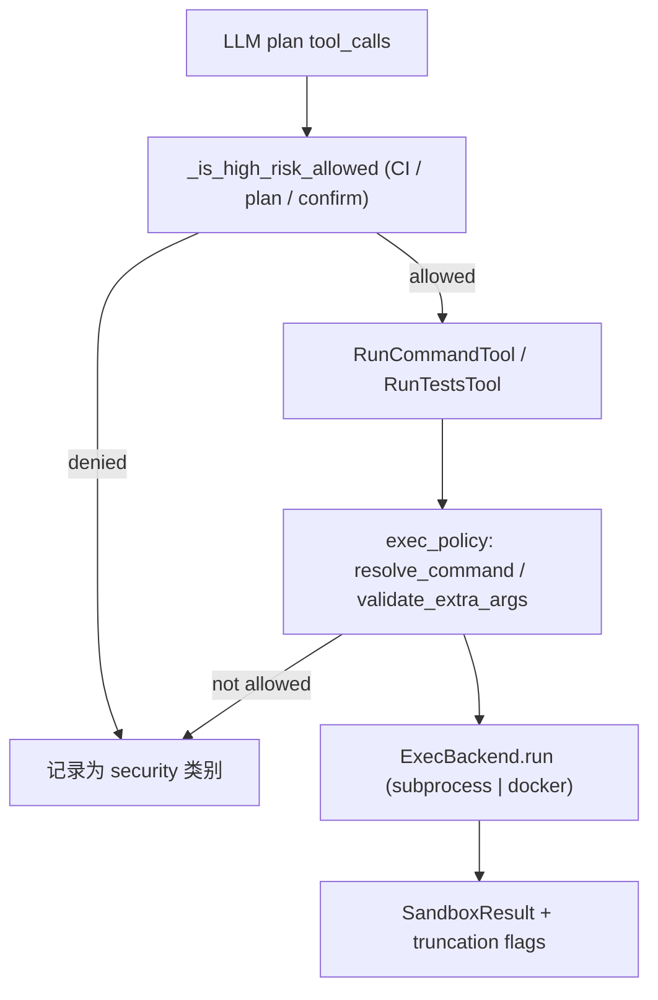

# Execute 类工具：设计思路与安全规范

本文档记录项目中 **execute 类工具**（`run_command`、`run_tests`）的设计原则、分层安全策略与配置约定。实现细节以代码为准。契约与环境变量见 [shared_contracts.md](./shared_contracts.md) §2 / §6；编排高危门控见 [cli_tools_orchestrator_contract.md](./cli_tools_orchestrator_contract.md) §11；路线图中的「已落地 / 待办」见 [mvp_plus_roadmap.md](./mvp_plus_roadmap.md) §1与 §3.1。

---

## 1. 目标与范围

- **目标**：在允许模型于 Debug 流程中运行有限命令的前提下，将命令执行面缩到最小、可审计、可配置，并避免 shell 注入、环境泄露与输出撑爆上下文。
- **范围**：仅涵盖 **execute 类**工具；不包含 `apply_patch` 等写入类工具。Docker 后端已落地为本地交互式 Debug 的可选执行后端；CI 仍默认拒绝 execute。

---

## 2. 设计原则

### 2.1 沙箱后端

- **默认**：`subprocess` 硬化——`shell=False`，仅接受解析后的 **argv 列表**。
- **可选**：Docker 作为可插拔后端（`Settings.execute_backend`）；通过 `docker run` 执行预构建镜像，保持 `shell=False`、workspace 挂载与输出截断语义和本地后端一致。

### 2.2 命令策略（混合）

- **`run_command`**：模型提供类 shell 的字符串 → 经 **`shlex.split`（posix）** 得到 argv → **首词白名单** 校验 → 后端执行。不提供「任意 shell 一行」能力。
- **`run_tests`**：在固定框架（如 `pytest` / `unittest`）下拼装 argv，再走 **同一套 policy + backend 管道**，并对 `extra_args` 做额外校验（见下文）。

### 2.3 暴露范围

- **仅 Debug 模式**向模型注册 execute 工具；**Review 模式**工具列表中不包含 `run_command` / `run_tests`，从可见能力上隔离「只读审查」与「可执行调试」。
- **全局总开关**：`execute_enabled`（环境变量 `EXECUTE_ENABLED`）为 false 时，即使 Debug 也不注册 execute 工具。

### 2.4 高危门控（与既有机制一致）

执行类操作仍受编排层 **`_is_high_risk_allowed`** 约束，与现有逻辑一致，例如：

- `permission_mode == "plan"` 时全禁；
- `CI` 等环境下默认拒绝；
- 其他情况下可通过 **`confirm_high_risk`** 回调做人工确认。

拒绝或策略失败时，与命令相关的错误在 `ContextState.errors` 中归类为 **`category="security"`**（含 `CommandNotAllowedError`）。

---

## 3. 架构与数据流

高层路径：

1. LLM 产生 tool_calls → **高危门控**通过与否；
2. **`RunCommandTool` / `RunTestsTool`** → **`exec_policy.resolve_command`**（及 `validate_extra_args` 等）；
3. **`ExecBackend.run`**（默认 `LocalSubprocessBackend`：`subprocess.run(argv, shell=False)` + 环境清洗 + 输出截断）；
4. 返回 **`SandboxResult`**（含 stdout/stderr 及截断标志）。

---

## 4. 关键组件（代码映射）

| 职责 | 主要位置 |
|------|-----------|
| 首词白名单、argv 解析、`git` 子命令只读限制、禁止 token、`extra_args` 校验、输出截断工具函数 | `src/security/exec_policy.py` |
| 后端协议、本地 subprocess 实现、环境清洗、Docker backend 实现 | `src/security/backends.py` |
| 按 `execute_backend` 派发、统一 `SandboxResult`（含 `stdout_truncated` / `stderr_truncated` 等） | `src/security/sandbox.py` |
| 命令不允许异常类型 | `src/tools/exceptions.py` → `CommandNotAllowedError` |
| `run_command` / `run_tests` 实现 | `src/tools/run_command_tool.py`、`src/tools/run_tests_tool.py` |
| 默认注册表是否包含 execute | `src/tools/__init__.py` → `create_default_registry(include_execute=...)` |
| Debug/Review 与 registry 构造时机 | `src/orchestrator/agent_loop.py` |
| 配置项 | `src/config.py` → `Settings` |

---

## 5. 配置项

下列项在 `Settings` 中定义，并可通过环境变量覆盖（具体见 `src/config.py` 与 `docs/shared_contracts.md`）。

| 配置字段 | 环境变量（典型） | 说明 |
|----------|------------------|------|
| `execute_enabled` | `EXECUTE_ENABLED` | 全局总开关；为 false 时不注册 execute 工具。 |
| `execute_backend` | `EXECUTE_BACKEND` | `subprocess`（默认）或 `docker`。 |
| `execute_allowed_commands` | `EXECUTE_ALLOWED_COMMANDS` | 逗号分隔；表示 **argv[0] 允许集合**。默认包含 `python`、`pytest`、`pip`、`node`、`npm`、`ruff`、`mypy`、`git` 等。 |
| `execute_default_timeout_ms` | `EXECUTE_DEFAULT_TIMEOUT_MS` | 默认超时（毫秒）。 |
| `execute_max_output_bytes` | `EXECUTE_MAX_OUTPUT_BYTES` | stdout/stderr **各自**字节上限；超出则截断并标记 `*_truncated`。 |
| `execute_docker_image` | `EXECUTE_DOCKER_IMAGE` | Docker execute backend 使用的镜像名；默认 `mergewarden-execute:latest`。 |
| `execute_docker_workdir` | `EXECUTE_DOCKER_WORKDIR` | 容器内工作目录；默认 `/workspace`。 |
| `execute_docker_network` | `EXECUTE_DOCKER_NETWORK` | Docker network 模式；默认 `none`。 |
| `execute_docker_memory_mb` | `EXECUTE_DOCKER_MEMORY_MB` | 可选内存限制（MB）；`0` 表示不设置。 |
| `execute_docker_cpus` | `EXECUTE_DOCKER_CPUS` | 可选 CPU 配额；`0` 表示不设置。 |

**`git` 子命令**：即使 `git` 在白名单内，仍只允许只读子集（实现中为 `status`、`diff`、`log`、`show`、`rev-parse` 等，以 `exec_policy` 为准）。

---

## 6. 安全规范

### 6.1 禁用 shell 解释

- 后端 **禁止** `shell=True`；所有执行使用 **argv 列表**。
- 管道、重定向、`&&` / `||`、命令替换等若出现在经 `shlex.split` 后的 token 中，由策略 **显式拒绝**（见 `_FORBIDDEN_TOKENS`），避免「看起来像参数实为 shell 元语法」的路径。

### 6.2 首词白名单

- 仅当 **第一个 token** 落在 `execute_allowed_commands` 中才允许执行；否则抛出 `CommandNotAllowedError`。

### 6.3 `git` 二次限制

- `argv[0] == "git"` 时，第二个参数必须在允许的只读子命令集合内，否则拒绝。

### 6.4 `run_tests` 的 `extra_args`

- 对预拆分参数列表执行 **`validate_extra_args`**：禁止与 shell / 特权相关的 token 与前缀（如实现中的 `--network`、`--privileged`、内联 `-c` 执行等），与 `run_command` 侧策略保持一致性。

### 6.5 工作目录

- 命令工作目录应限制在 **workspace 根目录内**（与既有 `ensure_path_allowed` 等路径策略一致），避免任意路径执行。
- Docker backend 会将当前 workspace root bind-mount 到 `EXECUTE_DOCKER_WORKDIR`，并把 host `cwd` 映射为容器内相对路径后执行。

### 6.6 环境变量清洗

- 子进程环境 **不继承**完整父进程环境；以 **白名单键** 从父环境拷贝允许变量（如 `PATH`、`HOME` / `USERPROFILE`、`LANG`、`LC_ALL`、`PYTHONPATH`、`VIRTUAL_ENV`、Windows 下 `SYSTEMROOT` / `TEMP` / `TMP` 等，以 `backends.build_scrubbed_env` 为准）。
- 按 **前缀 / 后缀** 剔除敏感变量（如 `OPENAI_`、`AWS_`、`AZURE_`、`GITHUB_` 前缀，以及 `_KEY`、`_SECRET`、`_TOKEN`、`_PASSWORD` 等后缀），降低密钥注入子进程的风险。
- Docker backend 对 host 进程仍使用 scrubbed env，并只把适合容器的变量通过 `-e` 透传，避免把 host `PATH`、`HOME` 等直接覆写到容器内。

### 6.7 输出截断

- 对 stdout/stderr 按字节上限截断，并设置 **`stdout_truncated` / `stderr_truncated`**，防止超大输出撑满日志与模型上下文。

### 6.8 编排层门控与错误分类

- 高危门控未通过时不得执行；策略拒绝使用 **`CommandNotAllowedError`**，并在错误流中 **`category="security"`**，便于监控与审计。

### 6.9 模式隔离

- **Review**：不向模型暴露 execute 工具名，减少误调用与攻击面。
- **Debug**：在 `execute_enabled` 为 true 时注册 execute 工具。

---

## 7. 演进与已知边界

- **Docker 后端**：当前范围仅覆盖本地交互式 Debug。默认依赖本地 Docker Desktop/Engine，不扩展到远程容器服务、Kubernetes 或 CI execute。
- **交互确认 UI**：复用既有 `confirm_high_risk` 契约，不在 execute 模块内重复实现一套确认逻辑。

### 7.1 最小演示流程

1. 构建执行镜像：`docker build -f Dockerfile.execute -t mergewarden-execute:latest .`
2. 设置环境变量：`EXECUTE_BACKEND=docker`
3. 运行 execute 级 smoke test：`pytest -q tests/test_docker_backend_smoke.py -rs`
4. 预期结果：命令在容器内执行，stdout/stderr 仍按 `SandboxResult` 结构返回，超时和缺失 Docker 可得到结构化错误。

---

## 8. 相关文档

- `docs/shared_contracts.md` — 环境变量与工具清单契约。
- `docs/cli_tools_orchestrator_contract.md` — 编排侧与工具契约（含白名单、argv 化、截断与错误分类说明）。

若本文与合约文档冲突，以 **合约为对外契约**、以 **源码为行为真相**；本文侧重 **设计意图与安全边界** 的固定记录。
