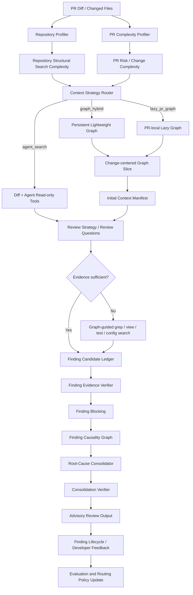

# MergeWarden Graph / Agent Search 路线与 A/B 实验规划

> 文档状态：规划基线  
> 适用范围：MergeWarden 当前已合并 Graph 分支后的主干版本  
> 核心目标：在控制其他变量一致的前提下，测量关系图对代码审查质量、成本、稳定性与跨文件分析能力的边际贡献，并据此形成仓库级、PR 级自适应上下文路由策略。

---

## 1. 背景与最终判断

MergeWarden 当前已经引入了持久化静态索引、Code Relation Graph、Change-Centered Context Planner、Candidate Context Manifest、Finding Evidence Verifier、Finding Causality Graph、Root-Cause Consolidator 等能力。

当前版本不应被简单描述为“纯 Graph Review”。更准确的定位是：

> **Graph-first、Manifest-bounded 的 LLM Review Pipeline**

其中：

- Code Relation Graph 负责结构化上下文发现；
- LLM Reviewer 负责语义判断与 Finding 假设生成；
- Evidence Verifier 负责确认 Finding 是否被真实代码证据支持；
- Finding Causality Graph 和 Consolidator 负责根因归并；
- 当前 Agent 仍保留只读工具能力，但默认上下文已明显受到 Graph 和 Manifest 约束。

长期目标不是在 Graph 与 Agent Search 之间二选一，而是构建：

> **Graph-grounded / Evidence-grounded Agentic Review**

最终架构原则：

1. 图负责结构化、可复用、可确定计算的上下文；
2. Agent Search 负责图无法可靠表达的语义、配置、动态调用和证据缺口；
3. 图是主要导航系统和证据骨架，不是唯一上下文来源；
4. 动态搜索是 Graph-guided fallback，而不是与图平行竞争的第二套主路径；
5. 是否建图应由仓库结构复杂度、PR 风险和图的可解析性共同决定；
6. Graph 的收益必须通过受控 A/B 测试证明，而不能通过新旧版本整体对比推断。

---

## 2. 核心研究问题

本轮实验需要回答以下问题。

### 2.1 质量问题

1. Graph 是否提高跨文件 Finding 的召回率？
2. Graph 是否提高两跳及以上依赖问题的召回率？
3. Graph 是否减少同名符号误匹配和无关上下文？
4. Graph 是否降低 Finding Evidence Verifier 的拒绝率？
5. Graph 是否改善根因归并质量？
6. Graph 是否会在小型、低耦合仓库中引入无收益上下文或误导？

### 2.2 成本问题

1. Cold Graph 的首次建图成本是多少？
2. Warm Graph 的增量更新成本是多少？
3. Graph 是否减少 Agent 的 `grep`、`read_file`、`find_symbol` 等动态工具调用？
4. Graph 是否减少 Reviewer Prompt 的无效上下文 token？
5. Graph 需要多少次后续 Review 才能摊销首次构建成本？
6. 在固定总预算下，Graph 是否仍然优于 Agent Search？

### 2.3 路由问题

1. 哪些仓库适合 `agent_search`？
2. 哪些仓库适合 `graph_hybrid`？
3. 哪些高风险 PR 即使位于小仓库中，也值得构建局部图？
4. 哪些低风险 PR 即使位于大仓库中，也不值得执行深度图遍历？
5. 如何根据实验结果形成自动化 Context Strategy Router？

---

## 3. 最终架构路线图



### 3.1 目标上下文模式

第一阶段实现两种正式模式：

```text
agent_search
graph_hybrid
```

后续可增加：

```text
graph_bounded
lazy_pr_graph
```

定义如下。

#### `agent_search`

- 不构建关系图；
- 不创建图索引；
- 不生成 Candidate Context Manifest；
- Reviewer 使用 diff 和只读工具自主调查；
- Finding 可引用 diff 与成功工具结果；
- 使用与 Graph 组相同的 Reviewer 核心、Verifier、根因归并和输出 Schema。

#### `graph_hybrid`

- 构建或复用关系图；
- 根据变更生成 Context Manifest；
- Reviewer 仍可使用只读工具补充证据；
- 动态搜索由 Review Question 和 Graph Evidence Gap 引导；
- Graph edge 只作为导航和结构证据，不自动等价于运行时事实；
- 使用与 Agent 组相同的 Reviewer 核心、Verifier、根因归并和输出 Schema。

#### `graph_bounded`（后续消融组）

- 构建图并生成 Manifest；
- Agent 动态搜索能力受到明显限制；
- 用于测量图自身可覆盖多少有效上下文；
- 不作为最终生产默认模式。

#### `lazy_pr_graph`（后续生产模式）

- 不维护完整持久图；
- 仅围绕 changed symbols、相关模块和候选调用方构建局部图；
- 适用于“小仓库但高风险 PR”或低频仓库。

---

## 4. 基线冻结策略

### 4.1 不直接使用合并 Graph 前的历史 commit 作为 Graph A/B 基线

历史 commit 可用于证明：

> MergeWarden 整体版本是否持续进步。

但不能用于严格证明：

> Graph 本身是否有效。

原因是历史版本与当前版本之间可能同时变化：

- Finding Schema；
- Reviewer Prompt；
- Evidence Verifier；
- Context Manifest；
- 根因归并；
- severity gate；
- provenance 规则；
- Eval matcher；
- 工具与运行参数。

这会形成多变量混杂。

### 4.2 正式基线定义

在当前版本基础上完成 Context Strategy、Prompt Policy、Evidence Policy 和 Eval Matcher 解耦后，跑通纯 Agent 路线，并冻结为：

```text
agent-baseline-v1
```

正式定义：

```text
Baseline
= 当前统一审查核心
+ agent_search Context Strategy
+ 当前 Finding Schema
+ 当前 Evidence Verifier
+ 当前 Root-Cause Consolidator
+ 当前统一 Eval 标准
```

Treatment 定义：

```text
Treatment
= 与 Baseline 完全相同的审查核心和 Eval
+ graph_hybrid Context Strategy
```

### 4.3 冻结内容

冻结的不只是 Git commit，还包括完整实验契约：

- 代码 commit SHA；
- Reviewer Prompt hash；
- Verifier Prompt hash；
- Consolidator Prompt hash；
- Finding Schema 版本；
- Eval dataset 版本；
- Eval matcher 版本；
- 模型名称和版本；
- temperature；
- max output tokens；
- Agent 最大轮次；
- 工具调用预算；
- timeout；
- repository snapshot SHA；
- Graph 配置；
- 随机种子或运行编号；
- 运行环境版本。

建议创建：

```bash
git tag eval/agent-baseline-v1
```

同时保存：

```text
eval/contracts/agent-baseline-v1.yaml
```

示例：

```yaml
experiment_contract:
  baseline_id: agent-baseline-v1
  code_commit: "<commit-sha>"
  context_mode: agent_search

  model:
    name: "<model-name>"
    temperature: 0
    max_output_tokens: 8192

  agent:
    max_iterations: 4
    tool_budget: 12
    timeout_seconds: 180

  prompts:
    reviewer_sha256: "<hash>"
    verifier_sha256: "<hash>"
    consolidator_sha256: "<hash>"

  output_schema:
    version: finding-v2

  eval:
    dataset_version: eval-dataset-v1
    matcher_version: matcher-v1
    repository_snapshot_sha: "<snapshot-sha>"
```

---

## 5. 解耦设计

### 5.1 Context Strategy 解耦

建议引入统一接口：

```python
class ContextStrategy(Protocol):
    async def prepare(
        self,
        request: ReviewRequest,
        tools: ReadOnlyToolset,
    ) -> ReviewContext:
        ...
```

实现：

```python
class AgentSearchContextStrategy:
    ...

class GraphHybridContextStrategy:
    ...

class LazyPRGraphContextStrategy:
    ...
```

Orchestrator 不应直接依赖 Graph 内部实现：

```python
context = await context_strategy.prepare(request, tools)
result = await reviewer.review(request, context, tools)
```

### 5.2 Prompt Policy 解耦

Prompt 分为三层：

```text
COMMON_REVIEW_PROMPT
AGENT_SEARCH_POLICY
GRAPH_CONTEXT_POLICY
```

公共 Prompt 负责：

- 审查目标；
- Finding Schema；
- changed-line 锚点；
- causal mechanism；
- violated invariant；
- repair intent；
- severity 规则；
- 工具安全边界；
- 输出停止条件。

Agent Search 附加规则：

- 当前没有 Graph Manifest；
- 证据可以来自 diff 或成功的只读工具结果；
- `context_manifest_id` 和 `context_hash` 留空；
- 不得伪造 Manifest 引用。

Graph Hybrid 附加规则：

- Manifest 是首轮上下文，不是完整世界；
- 图边用于导航和候选影响范围，不自动构成运行时证明；
- Manifest 证据必须复制真实 `context_manifest_id` 和 `context_hash`；
- 证据不足时允许定向工具搜索；
- 工具补充证据应记录独立 provenance。

### 5.3 Evidence Policy 解耦

两组使用同一个 Verifier 核心，只改变证据来源适配。

```python
class EvidencePolicy:
    require_manifest: bool
    allow_diff_evidence: bool
    allow_tool_evidence: bool
    require_context_hash: bool
```

Agent Search：

```python
EvidencePolicy(
    require_manifest=False,
    allow_diff_evidence=True,
    allow_tool_evidence=True,
    require_context_hash=False,
)
```

Graph Hybrid：

```python
EvidencePolicy(
    require_manifest=False,
    allow_diff_evidence=True,
    allow_tool_evidence=True,
    require_context_hash=True,
)
```

说明：

- Graph 组不应强制所有 Finding 都必须来自 Manifest，因为 Agent 允许动态补证；
- 引用了 Manifest 的 Finding 必须校验 Manifest ID 和 hash；
- 两组必须使用相同的语义验证标准；
- 不得让 Agent 组绕过 Evidence Verifier；
- 不得让 Graph 组因为存在图边而自动通过 Evidence Verifier。

### 5.4 统一 Finding Schema

两组共用同一个 Schema，Graph 专属字段为可选：

```python
class Finding(BaseModel):
    title: str
    severity: Severity
    path: str
    line: int

    evidence: list[Evidence]
    causal_mechanism: str
    violated_invariant: str
    repair_intent: str

    context_manifest_id: str | None = None
    context_hash: str | None = None
```

---

## 6. 实验分组

### 6.1 第一阶段主实验

| Variant | Context Mode | Graph | Agent Search | 用途 |
|---|---|---:|---:|---|
| A | `agent_search` | 否 | 是 | 正式纯 Agent 基线 |
| B1 | `graph_hybrid_cold` | Cold build | 是 | 测首次建图总成本 |
| B2 | `graph_hybrid_warm` | Incremental / cache reuse | 是 | 测长期实际收益 |

### 6.2 第二阶段消融实验

| Variant | Graph | Agent Search | 研究问题 |
|---|---:|---:|---|
| A | 否 | 是 | 纯 Agent 能力 |
| B | 是 | 受限 | 图自身上下文覆盖能力 |
| C | 是 | 是 | 最终混合方案 |
| D | 局部图 | 是 | 小仓库高风险 PR 的局部构图收益 |

### 6.3 两类预算实验

#### 固定 Agent 配置

两组保持相同：

- 模型；
- temperature；
- 最大轮次；
- 工具调用上限；
-最大输出 tokens；
- timeout。

用于回答：

> 相同 Reviewer 能力下，Graph 是否提高结果质量并减少无效探索？

#### 固定总成本预算

将 Graph build、增量维护、LLM token、工具调用和时间统一计入预算。

用于回答：

> 相同总成本下，Graph 是否比纯 Agent 更划算？

---

## 7. Cold、Warm 与摊销成本

### 7.1 Cold Graph

计入：

```text
首次仓库扫描
+ 全量索引构建
+ Graph 构建
+ Context Planning
+ Review
+ Verification
+ Consolidation
```

### 7.2 Warm Graph

计入：

```text
文件变更检测
+ 增量索引更新
+ Graph 局部更新
+ Context Planning
+ Review
+ Verification
+ Consolidation
```

### 7.3 摊销公式

```text
amortized_graph_cost(N)
=
initial_build_cost / N
+ average_incremental_update_cost
+ average_review_cost
```

其中 `N` 为该仓库预计后续 Review 次数。

需要输出 Graph break-even point：

```text
最少经过多少次 Review 后，
Graph Hybrid 的累计总成本低于或接近 Agent Search，
且质量指标不低于 Agent Search。
```

---

## 8. 数据集设计

### 8.1 数据集拆分

```text
development set
- 调 Prompt
- 修工具
- 调证据适配
- 调 Eval matcher
- 不用于最终结果

validation set
- 选择 Graph 配置
- 选择复杂度阈值
- 选择路由规则
- 不用于最终报告

held-out test set
- 最终一次或少量固定次数运行
- 不再据此修改 Prompt 和阈值
- 用于正式结果
```

### 8.2 仓库结构分层

至少覆盖四类：

| Repository Size | Structural Complexity |
|---|---|
| 小 | 低 |
| 小 | 高 |
| 大 | 低 |
| 大 | 高 |

“大小”只作为辅助属性，核心是结构搜索复杂度。

建议记录：

```python
class RepositoryComplexityProfile(BaseModel):
    source_files: int
    logical_loc: int
    symbol_count: int
    module_count: int
    language_count: int

    import_edge_count: int
    reference_density: float
    cross_module_edge_ratio: float

    sampled_two_hop_reach_p50: float
    sampled_two_hop_reach_p90: float
    sampled_two_hop_expansion_p90: float

    p95_fan_in: float
    p95_fan_out: float
    hub_score: float
    nontrivial_scc_ratio: float

    duplicate_symbol_ratio: float
    static_resolvability: float
    expected_review_frequency: float
```

### 8.3 PR 类型分层

每个 fixture 标记：

- single-file；
- cross-file；
- two-hop dependency；
- public API change；
- state/cache consistency；
- test gap；
- configuration-dependent；
- error-handling；
- transaction boundary；
- concurrency；
- dynamic dispatch；
- documentation/config-only；
- dependency upgrade。

### 8.4 Golden Finding 设计

Eval 不应依赖 Prompt 中的固定词汇。

建议：

```python
class GoldenFinding(BaseModel):
    semantic_id: str
    affected_paths: list[str]
    valid_line_ranges: list[LineRange]

    root_cause: str
    expected_mechanisms: list[str]
    violated_invariants: list[str]

    severity_min: Severity
    severity_max: Severity

    acceptable_variants: list[str]
    finding_category: str
    dependency_depth: int
```

匹配应综合：

- 位置重叠；
- 影响文件；
- 根因语义；
- causal mechanism；
- violated invariant；
- finding category；
- dependency depth。

不应只依赖标题字符串相似度。

---

## 9. 结果采集矩阵

### 9.1 质量指标

| 指标 | 定义 | 主要用途 |
|---|---|---|
| Golden Finding Recall | 命中的预期 Finding / 全部预期 Finding | 总体召回 |
| Cross-file Recall | 命中的跨文件 Finding / 跨文件 Golden | Graph 核心价值 |
| Two-hop Recall | 命中的两跳及以上 Finding / 对应 Golden | 多跳价值 |
| Precision | 正确 Finding / 全部输出 Finding | 误报控制 |
| False Positive Rate | 错误 Finding / 全部输出 Finding | 生产可用性 |
| Evidence-bound Rate | 有效证据支持的 Finding / 全部 Finding | 证据可靠性 |
| Verifier Rejection Rate | 被拒绝 Candidate / 全部 Candidate | 上下文质量 |
| Missing-evidence Rate | 因证据不足未通过 / 全部 Candidate | 搜索缺口 |
| Root-cause Recall | 正确识别根因组 / Golden 根因组 | 根因能力 |
| Over-merge Rate | 被错误归并的 Finding / 已归并 Finding | 归并风险 |
| Under-merge Rate | 应归并但未归并的组 / Golden 组 | 重复噪声 |
| Severity Accuracy | severity 落入允许区间的比例 | 风险判断 |
| Finding Stability | 多次运行 Finding fingerprint 一致性 | 稳定性 |

### 9.2 成本指标

| 指标 | 说明 |
|---|---|
| End-to-end Latency | 从请求开始到最终输出 |
| Graph Cold Build Latency | 首次全量构图 |
| Graph Incremental Latency | Warm 模式增量更新 |
| Context Planning Latency | Context Manifest 生成 |
| Reviewer Latency | Reviewer 阶段 |
| Verifier Latency | Evidence Verifier 阶段 |
| Consolidation Latency | 根因归并阶段 |
| Prompt Tokens | 各阶段输入 tokens |
| Completion Tokens | 各阶段输出 tokens |
| Total Tokens | 全链路 tokens |
| Tool Call Count | Agent 工具调用总数 |
| Grep Calls | 文本搜索次数 |
| Read File Calls | 文件读取次数 |
| Symbol Lookup Calls | 符号搜索次数 |
| Context Manifest Tokens | 图上下文 token 成本 |
| Parsed File Count | 图构建解析文件数 |
| Graph Node Count | 图节点数 |
| Graph Edge Count | 图边数 |
| Cache Hit Rate | Warm 图复用率 |
| Accepted Finding / 1K Tokens | 单位 token 有效产出 |
| Accepted Finding / Second | 单位时间有效产出 |
| Cost per Accepted Finding | 单个有效 Finding 的估算成本 |

### 9.3 Agent 行为指标

| 指标 | 说明 |
|---|---|
| Review Questions Count | 显式审查问题数量 |
| Evidence Gap Count | 发现的上下文缺口 |
| Search after Manifest | Graph 后仍需搜索的次数 |
| Tool Search Success Rate | 工具调用返回有效证据的比例 |
| Repeated Search Rate | 重复搜索相同内容的比例 |
| Out-of-scope Read Rate | 读取无关文件的比例 |
| Early Finding Capture | 阅读过程中记录 Candidate 的比例 |
| Candidate Revision Count | 新证据加入后 Finding 修改次数 |
| Stop-condition Efficiency | 达到足够证据后是否及时停止 |

### 9.4 复杂度分层结果矩阵

最终报告至少输出：

| 仓库类型 | Agent Search 质量 | Graph Cold 质量 | Graph Warm 质量 | 成本结论 | 推荐模式 |
|---|---:|---:|---:|---|---|
| 小 + 低复杂度 |  |  |  |  |  |
| 小 + 高复杂度 |  |  |  |  |  |
| 大 + 低复杂度 |  |  |  |  |  |
| 大 + 高复杂度 |  |  |  |  |  |

再按 PR 类型输出：

| PR 类型 | Agent Search Recall | Graph Hybrid Recall | Token 差异 | Tool Call 差异 | 结论 |
|---|---:|---:|---:|---:|---|
| Single-file |  |  |  |  |  |
| Cross-file |  |  |  |  |  |
| Two-hop |  |  |  |  |  |
| State / Cache |  |  |  |  |  |
| Test Gap |  |  |  |  |  |
| Public API |  |  |  |  |  |
| Dynamic Dispatch |  |  |  |  |  |

---

## 10. 配对实验执行方式

### 10.1 配对原则

同一个 fixture 的 A/B 运行必须保持：

- 相同 repository snapshot；
- 相同 base/head diff；
- 相同模型；
- 相同 temperature；
- 相同输出 token 上限；
- 相同 Agent 最大轮次；
- 相同工具预算；
- 相同 timeout；
- 相同 Reviewer 核心 Prompt；
- 相同 Verifier；
- 相同 Consolidator；
- 相同 Eval matcher。

只允许 Context Strategy 和与该策略直接相关的证据适配不同。

### 10.2 重复运行

每个 fixture 每个 Variant：

- 最低运行 3 次；
- 推荐运行 5 次；
- 高方差样本可增加到 10 次。

记录：

- mean；
- median；
- standard deviation；
- min/max；
- pass@k；
- Finding fingerprint 分布。

### 10.3 运行顺序

避免固定顺序造成模型服务状态或缓存偏差。

可以使用：

```text
Fixture 1: A → B1 → B2
Fixture 2: B2 → A → B1
Fixture 3: B1 → B2 → A
```

或者按固定随机种子打乱 Variant 顺序。

### 10.4 Graph Cold 隔离

Cold 运行前必须：

- 删除该 fixture 的图索引；
- 清除图缓存；
- 确认不存在旧 Manifest；
- 使用独立 index path；
- 记录全量构建开始和完成事件。

### 10.5 Graph Warm 隔离

Warm 运行必须：

- 从指定 Cold snapshot 继承索引；
- 只应用目标增量变更；
- 禁止重建全图；
- 记录 cache hit、invalidated files、updated nodes 和 updated edges。

---

## 11. 实验执行步骤

### Phase 0：现状审计

目标：确认 Graph 对当前链路的侵入范围。

检查：

- Graph 是否在 Orchestrator 中硬编码；
- Prompt 是否强制 Manifest；
- Verifier 是否只能接受 Manifest Evidence；
- Finding Schema 是否要求 Graph 字段；
- Eval 是否依赖 Graph 字段；
- Graph 关闭后是否仍创建索引；
- Graph 失败回退是否与 `agent_search` 等价。

输出：

```text
docs/graph-ab/current-coupling-audit.md
```

### Phase 1：Context Strategy 解耦

完成：

- `ReviewContextMode`；
- `ContextStrategy` Protocol；
- `AgentSearchContextStrategy`；
- `GraphHybridContextStrategy`；
- Orchestrator 注入；
- 独立 telemetry。

验收：

- `agent_search` 下 Graph Builder 调用次数为 0；
- 不创建 index；
- 不生成 Manifest；
- Agent 工具链可正常完成 Review；
- Graph 模式行为不退化。

### Phase 2：Prompt / Evidence Policy 解耦

完成：

- Common Prompt；
- Agent Search Policy；
- Graph Context Policy；
- Evidence Source Adapter；
- 可选 Manifest 字段。

验收：

- 两组输出同一 Finding Schema；
- 两组使用相同语义 Verifier；
- Agent 组不因缺少 Manifest 被拒绝；
- Graph 组不能靠低置信度边直接通过。

### Phase 3：Eval 解耦

完成：

- Golden Finding 语义化；
- Matcher 与 Prompt 文案解耦；
- Variant-aware EvalResult；
- 成本指标采集；
- Cold/Warm 标记；
- Repository Complexity Profile。

验收：

- 同一个输出在 Prompt 文案变化后，Eval 结果不发生无依据漂移；
- Eval 能独立识别正确 Finding、误报和根因；
- Eval 报告能按仓库、PR 类型、dependency depth 分组。

### Phase 4：Agent Baseline 调通

仅使用 development set：

- 调整 Agent Search 工具说明；
- 调整工具预算；
- 修复 timeout；
- 修复证据引用；
- 修复 Schema；
- 修复 Eval matcher。

禁止：

- 使用 held-out test set 调 Prompt；
- 为提高基线分数修改 Golden；
- 依据 Graph 结果反向优化 Agent Prompt。

### Phase 5：冻结 Agent Baseline

完成：

- tag；
- experiment contract；
- Prompt hash；
- Schema version；
- dataset version；
- matcher version；
- 环境锁定；
- baseline 报告。

输出：

```text
eval/contracts/agent-baseline-v1.yaml
eval/reports/agent-baseline-v1.md
```

### Phase 6：运行主 A/B

运行：

```text
A  = agent_search
B1 = graph_hybrid_cold
B2 = graph_hybrid_warm
```

分别输出：

- 全局结果；
- 仓库复杂度分层；
- PR 类型分层；
- Cross-file / Two-hop 专项；
- 成本与摊销；
- 统计稳定性。

### Phase 7：消融实验

运行：

```text
agent_search
graph_bounded
graph_hybrid
lazy_pr_graph
```

用于确认：

- Graph 与 Agent Search 的独立贡献；
- Dynamic Search 是否仍必要；
- 局部图是否可替代完整图；
- Context Manifest 的边际价值。

### Phase 8：形成自动路由策略

基于 validation set 形成：

```python
class GraphPlan(BaseModel):
    mode: Literal[
        "agent_search",
        "lazy_pr_graph",
        "graph_hybrid",
    ]
    graph_need_score: float
    reasons: list[str]
    confidence: float
```

使用 held-out test set 验证路由策略是否优于始终 Graph 或始终 Agent。

---

## 12. Repository Structural Search Complexity

不定义简单的“仓库大小”，而定义：

> **结构化搜索难度：纯文本搜索的歧义、多轮探索和遗漏成本，是否已经超过建图与维护成本。**

### 12.1 主要特征

1. Source files；
2. Symbol count；
3. Module count；
4. Reference density；
5. Cross-module edge ratio；
6. Two-hop reach；
7. Two-hop expansion ratio；
8. p95 fan-in / fan-out；
9. Hub score；
10. Nontrivial SCC ratio；
11. Duplicate symbol ratio；
12. Static resolvability；
13. Review frequency。

### 12.2 Cheap Probe Index

为避免“判断是否需要建图，却必须先建完整图”的悖论，先构建低成本 Probe Index：

包含：

- file；
- module；
- import；
- symbol definitions；
- 粗粒度 references。

暂不包含：

- 完整 call graph；
- field read/write；
- CFG；
- data flow；
- taint；
-完整 test mapping；
- execution flow。

Probe 输出 Complexity Profile，再决定：

```text
agent_search
lazy_pr_graph
graph_hybrid
```

### 12.3 初始 Graph Need Score

第一版只作为可解释规则，不作为最终真理：

```text
GNS
=
0.15 × Size
+ 0.20 × ReferenceDensity
+ 0.25 × MultiHopExpansion
+ 0.15 × CrossModuleRatio
+ 0.10 × HubAndCycle
+ 0.15 × SymbolAmbiguity
```

修正：

```text
AdjustedGNS
=
GNS
× StaticResolvability
× ReuseFactor
```

最终阈值必须由 A/B 实验校准。

---

## 13. PR Complexity Score

仓库级判断不能替代 PR 级判断。

建议记录：

```text
changed_file_count
changed_symbol_count
changed_module_count
public_api_change
schema_change
fan_in_of_changed_symbols
two_hop_reach_from_changed_symbols
stateful_change
cache_change
transaction_change
concurrency_change
test_distance
dynamic_dispatch_signal
```

路由矩阵：

| Repository GNS | PR Complexity | 推荐策略 |
|---|---:|---|
| 低 | 低 | `agent_search` |
| 低 | 高 | `lazy_pr_graph` |
| 中 | 低 | 轻量索引或 `agent_search` |
| 中 | 高 | `graph_hybrid` |
| 高 | 低 | 复用已有图但限制 hop |
| 高 | 高 | 完整 `graph_hybrid` |

---

## 14. 边界约束

### 14.1 单变量约束

Graph A/B 中不得同时修改：

- Reviewer 主 Prompt；
- Finding Schema 核心字段；
- Verifier 语义规则；
- severity 阈值；
- Consolidator；
- Eval matcher；
- Golden Findings；
- 模型；
-温度；
-工具预算；
-最大轮次。

Graph 模式只允许增加：

- Context Strategy；
- Manifest；
- Graph 专属证据适配；
- Graph telemetry；
- Graph 专属 Prompt 说明。

### 14.2 Eval 污染约束

禁止：

- 使用 held-out test set 调 Prompt；
- 根据最终结果修改 Golden；
- 删除 Graph 表现差的 fixture；
- 只汇报 Graph 优势类别；
- 忽略 Graph 构建成本；
- 只测 Warm 不测 Cold；
- 只测 Cold 不测 Warm；
- 用历史版本整体差异宣称 Graph 的边际收益。

### 14.3 成本边界

Graph 成本必须计入：

- 初次扫描；
- AST 解析；
- 索引持久化；
-增量更新；
- Context Planning；
- Manifest token；
- 存储；
-失效处理。

Agent Search 成本必须计入：

- 所有工具调用；
-工具返回 token；
-重复搜索；
-文件读取；
-额外模型轮次。

### 14.4 证据边界

- Graph edge 不是运行时证明；
- 低置信度边不能单独支撑高严重度 Finding；
- Manifest 外的工具证据必须真实来自成功调用；
- Finding 必须锚定具体代码位置；
- Finding 必须描述 causal mechanism；
- Finding 必须说明 violated invariant；
- Finding 必须给出根因导向的 repair intent；
- Evidence Verifier 必须可寻找反证；
- 不确定时宁可拒绝或降级，不得为了 Recall 强行发布。

### 14.5 产品边界

当前保持：

- advisory-only；
- 不默认阻止合并；
- 不默认自动修改代码；
- 不默认自动提交 commit；
- 不默认自动创建修复 PR；
- 不将未经确认的模型判断写入长期记忆；
- 不让 Graph 模块演化成与 Review 目标无关的通用代码图平台。

### 14.6 工程范围边界

本轮优先：

- Context Strategy；
- Prompt / Evidence 解耦；
- Eval；
- Telemetry；
- A/B；
- Router。

本轮不优先：

- 图可视化；
- community detection；
- Wiki 生成；
- 大量通用 MCP tools；
- 多仓库 daemon；
- 全语言覆盖；
- 向量搜索；
- 重型 CFG / data flow；
- 自动修复 Agent。

---

## 15. 关键测试

### 15.1 Agent Search 模式

```python
assert graph_builder.call_count == 0
assert graph_index_created is False
assert context_manifests == []
assert review_completed is True
assert verifier_executed is True
assert consolidator_executed is True
```

### 15.2 Graph Hybrid 模式

```python
assert graph_builder.call_count >= 1
assert context_manifest_count >= 1
assert manifest_hashes_are_valid is True
assert reviewer_tool_access_enabled is True
assert verifier_executed is True
assert consolidator_executed is True
```

### 15.3 Prompt 隔离

- Agent Prompt 不包含强制 Manifest 字段；
- Graph Prompt 不允许把图边视为事实；
- Common Prompt hash 在 A/B 之间一致；
- 只有 mode-specific policy hash 不同。

### 15.4 Eval 隔离

- Eval 不读取 Context Mode 来决定正确答案；
- Eval 不因 Graph 字段为空而自动扣分；
- Eval 只根据 Finding 质量、证据、根因和成本判断；
- Matcher 在所有 Variant 中版本一致。

### 15.5 Cold/Warm 隔离

- Cold 运行前索引不存在；
- Warm 运行前索引存在且 snapshot 可验证；
- Warm 不允许静默回退为全量重建；
- 若发生全量重建，必须标记为 invalid warm run。

---

## 16. 建议代码与目录结构

```text
src/
├── context/
│   ├── base.py
│   ├── agent_search.py
│   ├── graph_hybrid.py
│   ├── lazy_pr_graph.py
│   └── schemas.py
├── prompts/
│   ├── common_review.py
│   ├── agent_search_policy.py
│   └── graph_context_policy.py
├── evidence/
│   ├── policy.py
│   ├── diff_adapter.py
│   ├── tool_adapter.py
│   └── manifest_adapter.py
├── profiler/
│   ├── repository_profiler.py
│   ├── pr_profiler.py
│   └── graph_router.py
└── telemetry/
    ├── review_metrics.py
    └── graph_metrics.py

eval/
├── contracts/
│   └── agent-baseline-v1.yaml
├── datasets/
│   ├── development/
│   ├── validation/
│   └── held_out/
├── variants/
│   └── graph_ab_v1.yaml
├── reports/
├── runner.py
├── matcher.py
└── schemas.py

docs/
└── graph-ab/
    ├── current-coupling-audit.md
    ├── experiment-plan.md
    └── final-report.md
```

---

## 17. Variant 配置示例

```yaml
experiment_id: graph-ab-v1

shared:
  model: "<model-name>"
  temperature: 0
  max_output_tokens: 8192
  max_iterations: 4
  tool_budget: 12
  timeout_seconds: 180

  reviewer_prompt_version: common-review-v1
  verifier_version: evidence-verifier-v2
  consolidator_version: root-cause-v2
  finding_schema_version: finding-v2

  dataset_version: eval-dataset-v1
  matcher_version: matcher-v1

variants:
  - id: A-agent-search
    context_mode: agent_search
    graph_cache_mode: disabled

  - id: B1-graph-hybrid-cold
    context_mode: graph_hybrid
    graph_cache_mode: cold

  - id: B2-graph-hybrid-warm
    context_mode: graph_hybrid
    graph_cache_mode: warm
```

---

## 18. 最终决策标准

不提前设定“Graph 必须胜出”。

实验可能产生三类结论。

### 18.1 Graph 普遍胜出

表现：

- Cross-file / Two-hop Recall 明显提高；
- Precision 不下降；
- Warm 成本可快速摊销；
- Tool calls 和 token 明显下降；
- 各类仓库收益稳定。

决策：

- `graph_hybrid` 作为默认；
- 小型、低复杂度仓库允许降级为 `agent_search`。

### 18.2 Graph 只在结构复杂仓库胜出

表现：

- 小型、低复杂度仓库中 Agent 更快且质量相同；
- 高跨模块、多跳、高歧义仓库中 Graph 明显占优；
- Warm 模式收益较好；
- Cold 模式需要一定 Review 次数回本。

决策：

- 实现 Repository Profiler + PR Router；
- `agent_search` 与 `graph_hybrid` 自适应选择；
- 这是当前最预期、也最有工程价值的结论。

### 18.3 Graph 收益不足

表现：

- Cross-file Recall 提升有限；
- Precision 下降；
- 图解析率低；
- Dynamic Search 仍占大部分成本；
- Warm 模式仍难摊销。

决策：

- 不继续扩张完整图；
- 保留 qualified symbol、import、direct reference 等轻量索引；
- 转向 `agent_search + lightweight navigation index`；
- 高风险 PR 使用 `lazy_pr_graph`。

---

## 19. 项目最终叙事

如果实验完成，MergeWarden 的项目亮点不应表述为：

> 我实现了一个代码关系图。

而应表述为：

> **设计并实现了成本感知、证据约束的 PR Review Agent。通过受控 A/B 实验比较纯 Agent Search、Cold Graph 和 Warm Graph，在仓库结构复杂度、PR 风险、跨文件召回、误报率、token、延迟和工具调用等维度量化 Graph 的边际收益，并据此实现自适应 Context Strategy Router。**

更完整的定位：

> **A change-centered, evidence-grounded PR review agent that selects between agentic search and graph-guided investigation based on repository structural complexity and PR risk, verifies every finding against exact code evidence, and consolidates duplicate symptoms into independently validated root causes.**

---

## 20. 最终交付物

本路线完成后应形成：

1. Context Strategy 抽象；
2. 可运行的 `agent_search`；
3. 可运行的 `graph_hybrid`；
4. 冻结的 `agent-baseline-v1`；
5. 版本化 Prompt、Schema、Eval 和实验契约；
6. Cold / Warm Graph 实验能力；
7. Repository Complexity Profile；
8. PR Complexity Profile；
9. A/B 数据集与 Golden Findings；
10. 配对实验 Runner；
11. 结果采集与分层报告；
12. Graph break-even 分析；
13. Context Strategy Router；
14. held-out test 最终报告；
15. 面向 README、简历和面试的实验结论摘要。

---

## 21. 执行优先级

### P0：实验有效性的基础

- Context Strategy 解耦；
- Prompt Policy 解耦；
- Evidence Policy 解耦；
- Eval Matcher 解耦；
- Agent Baseline 跑通；
- Baseline 冻结。

### P1：主实验

- Agent / Cold Graph / Warm Graph；
- 质量、成本和稳定性采集；
- Cross-file / Two-hop 专项；
- 仓库复杂度分层；
- PR 类型分层。

### P2：生产策略

- Cheap Probe Index；
- Repository Profiler；
- PR Profiler；
- Context Strategy Router；
- Lazy PR Graph。

### P3：后续增强

- Review Strategy Planner；
- Finding Candidate Ledger；
- Graph-guided Evidence Gap Search；
- Finding 生命周期；
- Developer feedback loop；
- 风险自适应 Review Effort。

---

## 22. 一句话路线

```text
在当前主分支完成 Context、Prompt、Evidence 与 Eval 解耦
→ 跑通并冻结统一标准下的纯 Agent Baseline
→ 只增加 Graph Context Strategy 形成受控 A/B
→ 同时测试 Cold、Warm、质量、成本和稳定性
→ 按仓库结构复杂度与 PR 风险分层分析
→ 用实验结果建立 agent_search / lazy_pr_graph / graph_hybrid 自适应路由
→ 将 MergeWarden 演进为成本感知、证据驱动的 Agentic Review 系统
```
