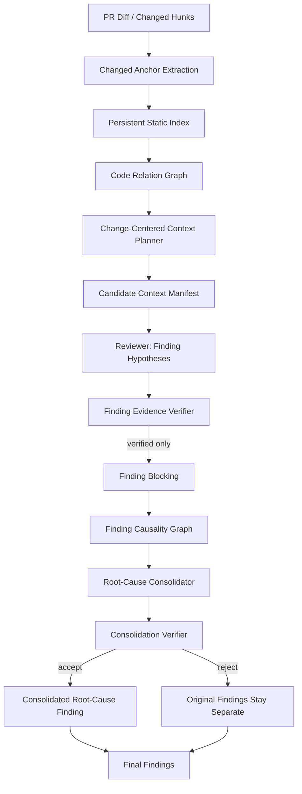
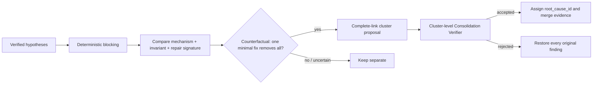
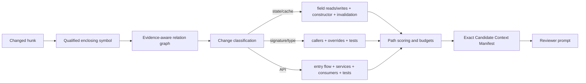
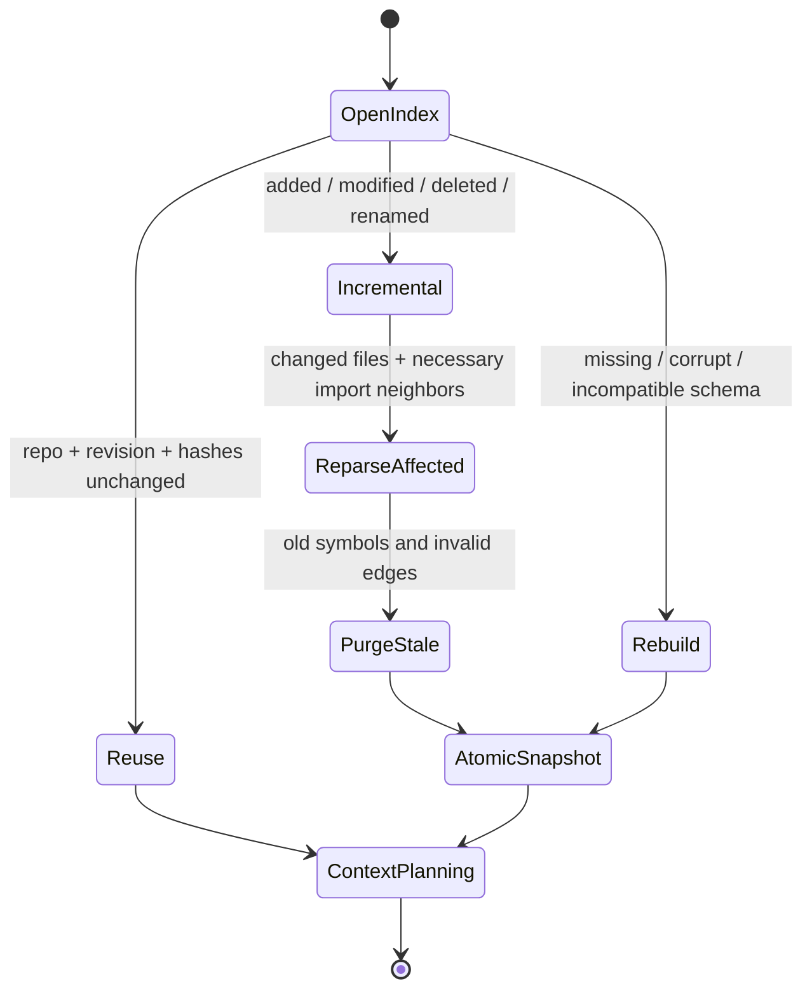

# v0.2.3–v0.2.5 根因级审查、关系图与增量索引

本文描述 v0.2.3、v0.2.4 和 v0.2.5 已落地的审查链路、数据契约、配置、迁移方式、评测方法和当前边界。实现保持 v0.2.2 的 changed-line 主锚点和候选上下文证据规则，同时把最终输出单位从局部症状升级为经过两道验证门的独立修复单元。

## 总体流水线



职责边界如下：

- 静态索引和代码关系图回答“这次改动应看哪些代码”，不直接产生 finding。
- Reviewer 产生具体、可验证的 finding hypothesis；它可以在单个 candidate 内做局部预归并，但不分配稳定 `root_cause_id`。
- Finding Evidence Verifier 验证单条 hypothesis 是否得到实际发送上下文支持。
- Root-Cause Consolidator 判断多个已验证 hypothesis 是否属于一个最小修复单元。
- Consolidation Verifier 独立验证共同机制、不变量、修复范围和证据并集；失败时保留原 findings。

代码图中的 graph community、`CALLS`、`CONTAINS` 或共同文件关系都不等于 root-cause cluster。

## 实现映射

| 层 | 实现 |
|---|---|
| Finding schema / compatibility | `src/analyzer/finding_schema.py`, `src/analyzer/output_formatter.py` |
| Reviewer contract / prompt | `src/orchestrator/tool_schemas.py`, `src/analyzer/prompts.py` |
| 单 finding 验证门 | `src/analyzer/finding_verifier.py`, `src/analyzer/verifier_context.py` |
| Finding blocking / causality / consolidation | `src/analyzer/root_cause.py` |
| 静态索引与代码关系图 | `src/analyzer/code_graph.py`, `src/tools/symbol_backends.py` |
| Context Planner / Manifest | `src/analyzer/context_planner.py`, `src/analyzer/context_state.py` |
| 持久化与增量更新 | `src/analyzer/persistent_index.py` |
| 可选语言解析增强 | `src/analyzer/language_resolver.py` |
| 运行时编排与事件 | `src/orchestrator/agent_loop.py`, `src/analyzer/event_log.py` |
| 指标与消融 | `eval/schemas.py`, `eval/runner.py`, `eval/root_cause_benchmark.py` |

## v0.2.3：Root-Cause Consolidation

### Finding schema 2.0

`ReviewIssue` 仍保留 v0.2.2 必需字段 `severity/location/evidence/suggestion/confidence/candidate_id`，并增加 schema 2.0 的结构化 hypothesis 字段。最小形态如下：

```json
{
  "schema_version": "2.0",
  "finding_id": "F-08",
  "root_cause_id": "",
  "primary_anchor": {
    "file": "src/model.py",
    "line": 84,
    "symbol_id": "python|src/model.py|Recognizer.load_model|method|84:120"
  },
  "related_locations": [],
  "observed_behavior": "...",
  "causal_mechanism": "...",
  "violated_invariant": "...",
  "repair_intent": {
    "action": "...",
    "targets": ["Recognizer._model_cache_key"],
    "boundary": "cache lifecycle"
  },
  "trigger": "...",
  "impact": "...",
  "cause_evidence": [],
  "contract_evidence": [],
  "trigger_evidence": [],
  "impact_evidence": [],
  "context_manifest_id": "C-12"
}
```

Reviewer 的 tool schema 不包含 `root_cause_id`；该 ID 只在 cluster 建立后由 Consolidator 以稳定成员集合生成。最终 finding 可通过 `member_findings`、`absorbed_roles`、`counterfactual_result` 和 `merge_rejection_reasons` 表达归并结果或回退原因。

每项 `EvidenceProvenance` 至少保存：

```text
candidate_id, context_manifest_id, retrieval_source, file, line/end_line,
symbol_id, context_hash, edge_kind, edge_confidence, resolver,
evidence_eligibility, statement
```

四类证据不得混用：

- `cause_evidence`：直接支持因果机制；
- `contract_evidence`：支持具体不变量或契约；
- `trigger_evidence`：仅支持触发条件；
- `impact_evidence`：仅支持影响范围。

### Reviewer 与第一道验证门

Reviewer prompt 要求先枚举观察，再区分 trigger、symptom 和 impact，并为每个独立 repair unit 输出一个 hypothesis。不确定时保持分离；相同模块、函数、调用链、graph community 或措辞相似都不是归并理由。

Finding Evidence Verifier 继续执行 v0.2.2 门控，并对 schema 2.0 增加：

- `primary_anchor` 必须命中 changed line；
- observed behavior、causal mechanism、invariant 和 repair signature 必须完整；
- trigger/impact 存在时必须各自有证据；
- provenance 的 manifest ID、文件、span 和 SHA-256 `context_hash` 必须与实际 Manifest 一致；
- 跨文件证据必须出现在该 candidate 的 Manifest；
- 低置信度或 exploratory 图边不能单独支撑 accepted verdict；
- candidate 未收到的新代码或机制会被 fail closed 拒绝。

Verifier 的 bounded candidate context 不再只围绕 finding 主位置收集。它按 `主位置 → cause → contract → trigger → impact → related location` 的固定优先级遍历 finding 实际引用的位置，并分别保留覆盖这些位置的 diff hunk、成功工具读取 window、symbol context 和已选择 Manifest span/path。达到字符预算后只裁掉更低优先级位置，不把整文件塞入 verifier；不存在、未成功读取或已被预算裁掉的位置仍按 fail-closed 规则拒绝。

Structured evidence 的来源标签和 candidate identity 由系统绑定，不再信任模型自报。candidate 构建后，系统把 canonical candidate ID 写回 issue 及全部 evidence；每条 evidence 再与实际 diff、成功工具结果和 Manifest span 对照。模型声明已被观察事实支持时保留；声明错误但只有一个可信来源覆盖该位置时归一化为该来源；没有来源或多个来源都可成立但无法唯一选择时不猜测，交给 deterministic gate fail closed。

Graph-hybrid finding 可以逐条混用可信来源：例如 cause/contract 来自 Manifest、trigger 来自 diff、impact 来自成功 `read_file`。Manifest evidence 单独核验 id、span hash、位置以及 strong edge 合同；diff 与工具 evidence 分别核验 retained hunk 和具体成功工具来源，不再被 issue-level Manifest id 强制同源。semantic verifier 返回 revised finding 时，系统只用该 verifier 实际收到的 bounded context 重新绑定来源，然后重新执行完整确定性校验；新增的未见位置、错误 hash、缺失 read 和低可信 graph edge仍拒绝。

只有 accepted 的 Warning/Critical hypothesis 才进入归并阶段。Info/Style 和被拒绝项不参与 merger。

### Blocking、Finding Causality Graph 与保守聚类

Blocking 使用 qualified symbol、repair target 交集、相同 invariant 且 repair scope 相交、证据角色重叠、同 class 状态读写等确定性信号。少量 finding 可以进入统一小 block，但接口和 block 指标始终保留。单独的同文件、同模块、同函数、调用链、community 或文本相似不会建立 blocking/merge 事实。

Finding Causality Graph 与 Code Relation Graph 是两个独立对象：

```json
{
  "source": "F-02",
  "target": "F-04",
  "kind": "SAME_REPAIR_UNIT",
  "rationale": "same action, targets and modification boundary",
  "confidence": 1.0
}
```

边类型包括 `SAME_CAUSAL_MECHANISM`、`VIOLATES_SAME_INVARIANT`、`SAME_REPAIR_UNIT`、`SYMPTOM_OF`、`TRIGGER_OF`、`IMPACT_OF`、`RELATED_BUT_INDEPENDENT` 和 `UNCERTAIN`。



Minimal repair signature 是 `action + target symbols/state + modification boundary`。只接受明确的 `counterfactual_result=yes`。实现使用 complete-link cluster 整体验证，不使用 Union-Find 传递闭包，因此不会因 A/B、B/C 可合并而自动把不兼容的 A/C 合成三节点 cluster。

第二道 Consolidation Verifier 会验证共同机制、具体且一致的不变量、修复覆盖、成员证据并集、新机制注入、trigger/impact/related location 保留及 changed-line 主锚点。失败时记录 rejection reason 并原样恢复成员 findings。

### 多位置 finding

最终 finding 保留一个最能体现共同根因且命中 changed line 的 `primary_anchor`。其他契约、状态或成员位置进入带 role 的 `related_locations`；成员证据按 role 去重合并。单主锚点的旧发布协议不再迫使同一根因被拆成多个 finding。

## v0.2.4：Change-Centered Relation Graph



### 节点、边与 qualified identity

最低节点集合为 `File/Class/Function/Method/Field/Test/ChangedHunk`。最低边集合为 `ENCLOSED_BY/CONTAINS/CALLS/CALLED_BY/IMPORTS/REFERENCES/READS_FIELD/WRITES_FIELD/TESTED_BY/INHERITS/IMPLEMENTS`。

Python 使用标准 AST 做两阶段索引；现有 Rust/C# heuristic backend 被保留为保守 fallback；不支持语言只生成低置信度 File 节点并记录诊断。旧裸名称 reference 搜索继续兼容，但标记为 `TEXTUAL`、低置信度、仅 exploratory，不能伪装成精确 binding。

稳定符号 ID 组合 language、repo-relative path、qualified scope、kind 和 declaration span：

```text
python|src/service.py|Recognizer.load_model|method|84:120
```

对应显示名为 `src/service.py::Recognizer.load_model`。相同裸名称但不同 class/file 会产生不同 ID。

### 边 provenance 与语义边界

```json
{
  "source": "...",
  "target": "...",
  "kind": "CALLS",
  "path": "src/service.py",
  "line": 42,
  "resolver": "ast_direct_call",
  "confidence": 1.0,
  "confidence_tier": "EXTRACTED",
  "evidence_eligibility": "strong",
  "reason": "direct qualified call resolved to one declaration"
}
```

Tier 支持 `EXTRACTED/RESOLVED/INFERRED/AMBIGUOUS/TEXTUAL`，但 verifier 同时检查 resolver、具体 reason、confidence 和 eligibility，而不是只信任 tier 名称。

语义边界必须保留：

- `CALLS` 证明调用关系，不证明参数值或运行时对象身份；
- `REFERENCES` 证明符号关联，不证明动态对象一致；
- `READS_FIELD` 证明字段读取，不证明它读取了哪次写入；
- `WRITES_FIELD` 证明字段写入，不证明该路径必然执行；
- `TESTED_BY` 证明结构关联，不证明分支覆盖。

Tree-sitter（若后续接入）或 AST 抽取都不等于 LSP 的精确 binding。

### Context Planner 与 Manifest

Planner 强制保留 changed hunk、enclosing symbol、signature、必要 class context 和直接 field 定义/赋值。可选路径按下式排序：

```text
context_score =
    change_relevance
  × edge_confidence
  × semantic_role_weight
  × distance_decay
  × evidence_value
```

Planner 支持 token/字符预算、最大节点数、最大深度、边类型权重、节点/span 去重、截断原因、强证据优先和低置信度探索隔离。它不会把全部一至两跳邻居无条件送入模型。

Manifest 中的 `included_spans` 作为 candidate 核心块参与 `PROMPT_INPUT_TOKEN_BUDGET`，`included_graph_paths` 作为独立的低优先级块在剩余预算内选择；未选中的 path 不进入 Reviewer prompt。`excluded_low_confidence_paths` 和 `discarded_paths` 仅保留在审计状态/事件日志中，不进入 prompt，也不具备 accepted evidence 资格。

```json
{
  "candidate_id": "C-12",
  "changed_anchor": {},
  "included_spans": [],
  "included_graph_paths": [],
  "excluded_low_confidence_paths": [],
  "discarded_paths": [],
  "token_cost": 1840,
  "truncation_reasons": []
}
```

## v0.2.5：持久化、增量更新与可选解析增强



SQLite index schema version 3 保存 repository identity、revision、file hash、node/edge payload、resolver metadata、build version 和创建/更新时间。默认位置为 `.mergewarden/relation-index.sqlite3`。

增量构建根据文件 hash 识别新增、修改和删除，并扩展到必要的 import/incoming 邻接文件；解析阶段只重建 affected files。删除或 rename 会清理旧 symbol identity 与失效 edge。schema 不兼容或数据库损坏时，旧文件以 `.corrupt-*`/`.incompatible-*` 形式保留后安全重建；持久化不可用时仍可用内存 AST 图执行基础 review。

解析模式：

- `ast`：默认，仅 AST/现有 heuristic backend；
- `resolver`：AST 加可注入 language resolver；
- `lsp`：尝试 LSP enrichment；当前没有可用 LSP adapter 时明确记录 `UnavailableLspResolver` 诊断并回退 AST。

LSP 不是硬依赖。所有 enrichment 必须记录 resolver、confidence、fallback 和 error diagnostics，不能把失败或启发式结果升级成精确 binding。

有限 execution flow 仅围绕 changed symbol 枚举预算内 direct caller/callee、相关 test、inheritance/implementation 和 field read/write 路径。当前实现不是完整 SSA、reaching definitions、alias analysis、精确动态派发或编译器级跨过程数据流。

## Provenance 规则

1. Reviewer 只能引用其 Candidate Context Manifest 中实际包含的 span/path。
2. `context_hash` 是 included span 原始内容的 SHA-256；文件和行必须落在该 span 内。
3. 跨文件 evidence 必须来自 Manifest；被裁剪、discarded 或低置信度 exploratory path 不能支撑 accepted verdict。
4. Consolidator 默认只使用 `union(member_findings.allowed_contexts)`。
5. 额外检索必须通过 `extend_manifest` 创建新的 manifest extension 和 retrieval provenance，再由 Consolidation Verifier 验证；不能伪装为原 candidate 上下文。
6. 图边只用于其明示的结构事实，不能越过前述语义边界推导新机制。

## 配置

| 环境变量 | 默认值 | 合法范围 / 说明 |
|---|---:|---|
| `ROOT_CAUSE_CONSOLIDATION_ENABLED` | `true` | 关闭后跳过 merger，恢复 v0.2.2 风格的逐条 verified findings |
| `ROOT_CAUSE_CONSOLIDATION_MAX_BLOCK_SIZE` | `16` | 2–100 |
| `ROOT_CAUSE_CONSOLIDATION_CONSERVATIVE_MODE` | `true` | true 时只对小批量统一 blocking；false 可扩大候选 block，但两种模式都保持 complete-link + 明确 `yes` counterfactual |
| `ROOT_CAUSE_CONSOLIDATION_EXTRA_RETRIEVAL_ENABLED` | `false` | 仅在 true 时接受显式 manifest extension；默认拒绝 consolidation-time 新检索 |
| `RELATION_GRAPH_ENABLED` | `true` | 关闭后使用 v0.2.2 tool-context 路径 |
| `RELATION_GRAPH_PERSISTENCE_ENABLED` | `true` | false 时使用内存构建 |
| `RELATION_GRAPH_INDEX_PATH` | `.mergewarden/relation-index.sqlite3` | 必须为非空路径 |
| `RELATION_GRAPH_MAX_DEPTH` | `2` | 0–6 |
| `RELATION_GRAPH_MAX_NODES` | `40` | 1–500 |
| `RELATION_GRAPH_MAX_CONTEXT_TOKENS` | `4000` | 128–64000 |
| `RELATION_GRAPH_MIN_EVIDENCE_CONFIDENCE` | `0.65` | 0.0–1.0 |
| `RELATION_GRAPH_LSP_ENRICHMENT_ENABLED` | `false` | true 时把 resolver mode 规范为 `lsp` |
| `RELATION_GRAPH_RESOLVER_MODE` | `ast` | `ast/resolver/lsp` |
| `RELATION_GRAPH_MAX_FILES` | `5000` | 1–100000 |
| `RELATION_GRAPH_MAX_AMBIGUOUS_TARGETS` | `4` | 1–100；超过上限的歧义候选不物化为边，只记录汇总诊断 |

非法值由 Pydantic Settings 在启动时给出明确 validation error。

## 迁移与兼容

### v0.2.2 → v0.2.3

- 旧 `ReviewIssue` JSON 可直接解析，缺少新字段时 `schema_version=1.0`。
- 新 Reviewer 输出 `schema_version=2.0` hypothesis；`ReviewReport.v022_payload()` 可降级到旧 envelope。
- CLI/GitHub 继续使用原 `location/evidence/suggestion`，并在有 root-cause 信息时附加机制、不变量和 related locations。
- 旧 consumer 若不能识别新增字段，应读取 `v022_payload()`；不要让 Reviewer 预先写 `root_cause_id`。

### v0.2.3 → v0.2.4

- Context State 新增 Manifest 和非源码 graph summary；旧 tool-context 仍可作为 fallback。
- 旧裸 symbol 搜索继续可用，但 metadata 明确标记低置信度 textual fallback。

### v0.2.4 → v0.2.5

- 首次运行创建 schema v3 SQLite index；旧或不兼容缓存会保留后重建，无需手工迁移。
- 关闭 persistence、graph 或 consolidation 可分别回退到内存索引、v0.2.2 上下文或逐条 verified finding。

## 可观测性

JSONL event log 记录 index build/reuse/rebuild、anchor/node/edge 数、Planner 选择与裁剪、Manifest token cost、单 finding verdict、block、merge proposal、counterfactual、归并验证/rejection/fallback 和阶段耗时。`finding_verification_completed.deterministic_rejection_details` 对每个失败的 finding/evidence 记录 candidate/finding ID、evidence role/index、retrieval source、文件/行号、失败字段、具体 fail-closed 规则以及是否来自 verifier revised finding；不再只保留聚合的 `deterministic_evidence_invalid`。事件只记录路径、ID、计数、hash、原因与受限摘要，不记录模型密钥或整仓源码。

Eval process metrics 增加 root-cause coverage、over/under-merge、repair-unit accuracy、evidence completeness、finding inflation ratio、graph/context 规模、discarded paths、unused context、edge confidence contribution、build/incremental latency、cache hit rate、block 数和平均 block size。

在有人工 root-cause 标注的 eval/benchmark 中，`finding_inflation_ratio = verified/final finding count ÷ expected independent root-cause count`；运行时没有真值时，事件中的同名过程指标使用 merger 输入数 ÷ 输出 root 数，作为症状压缩强度诊断。

## Benchmark 与消融

确定性 fixture benchmark 不调用模型，因此 `model_token_usage=0` 和 `reviewer_tool_call_count=0` 是实测值，而非估算。运行：

```bash
python -m eval.root_cause_benchmark --ablations A,B,C,D,E,F,G,H,I \
  --output artifacts/v025_benchmark.json
```

消融含义：A=v0.2.2 compatibility，B=structured schema，C=consolidator，D=consolidation verifier，E=qualified identity，F=relation graph/planner，G=field edges，H=bounded execution flow，I=optional LSP resolver/fallback。

当前内置 SafeHash/Vosk fixture 的确定性断言为：A/B 输出 7 个症状 finding、inflation 1.75；C/D 输出 4 个独立 root cause、inflation 1.0；root-cause coverage 1.0、FPR 0、over-merge 0、repair-unit accuracy 1.0。实际 latency 和图规模以每次生成的 JSON 为准，不在文档中硬编码。

## 已知限制

- Python AST binding 最完整；Rust/C# 仍复用保守 heuristic，其他语言为 file-only fallback。
- 当前仓库未捆绑真实 LSP server/adapter；`lsp` 模式会产生诊断并安全回退 AST。
- execution flow 是 change-centered 有界结构路径，不证明运行时可达性。
- field edges 不含 reaching-definition 或 alias identity；动态反射、猴子补丁和复杂 re-export 可能保持 ambiguous。
- 确定性 benchmark 验证聚类与图质量，不替代需要 provider credentials 的完整 golden model eval。
